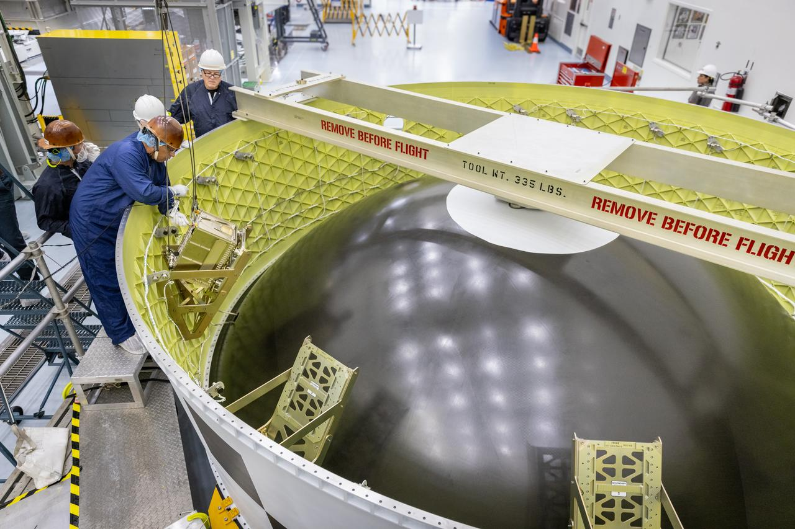

# Rocket Lab卫星分离系统成功助力Artemis II立方星部署

**摘要：** 2026年4月13日，Rocket Lab公司宣布，其 canisterized Satellite Dispensers（CSD）卫星分离系统在Artemis II任务中发挥了关键作用，成功将4颗立方星部署至高地球轨道，最高运行高度达4万公里。这些立方星在SLS火箭上面级与猎户座飞船分离后约5小时部署，为未来月球及深空探测任务提供了重要的技术验证。

*图片来源：NASA*

## 任务详情

2026年4月1日，NASA执行了Artemis II载人绕月任务——这是50多年来首次人类登月相关飞行任务。在SLS火箭巨大的有效载荷整流罩内，集成在猎户座级间适配器（Orion Stage Adapter，OSA）中的4颗立方星也随之升空。这些立方星在OSA与猎户座飞船分离约5小时后，从Rocket Lab的CSD系统中被释放，开始执行高地球轨道实验任务。

Rocket Lab CSD分离系统在本次任务中承担了关键角色：确保每颗立方星在正确的时间、速度和姿态下被释放，这一能力在距地球4万公里的高轨道运行中尤为关键。

## 韩国KASA立方星参与

在Artemis II任务中，韩国航空宇宙厅（KASA）的K-Rad Cube是参与部署的立方星之一。Rocket Lab的CSD系统为K-Rad Cube提供了安全可靠的部署解决方案，能够承受发射过程中的极端振动和热环境，同时确保卫星在精确的条件下释放入轨。

## CSD系统的可靠性

Rocket Lab分离系统高级总监Alex Zajac表示："每次部署都是一次关键时刻。我们花费了数年时间设计、分析和测试CSD系统，确保它们在舱门打开、弹簧将立方星推入太空的那一瞬间完美工作。看到它们在Artemis II最具挑战性的飞行条件下都完美完成任务，团队中每个人的脸上都洋溢着笑容。"

对于Artemis II这样的载人任务，CSD系统的可靠性要求更为严苛——必须满足严格的载人发射安全标准，且不对宇航员或其主要任务构成任何风险。在本次任务中，Rocket Lab的4套CSD均按预期完美工作。

## 深空探测意义

参与Artemis II任务的立方星代表了多个国家和新技术，它们将帮助开发未来月球和火星探测所需的技术。Rocket Lab的CSD系统展示了现代航天的一个重要现实：即使是最小的系统也能产生巨大影响。

## 信息来源（原文）

- [Rocket Lab CSD Satellite Separation Systems Power CubeSat Missions on Artemis II - Rocket Lab](https://www.rocketlabusa.com/updates/rocket-lab-csd-satellite-separation-systems-power-cubesat-missions-on-artemis-ii/)
