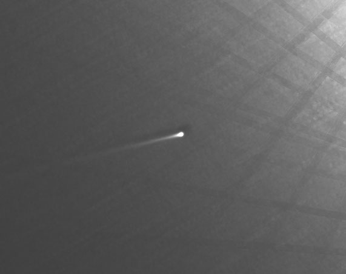

# SOHO日冕仪观测到一颗掠日彗星在飞掠太阳时解体

**摘要：** 2026年4月4日，一颗名为C/2026 A1（MAPS）的克鲁兹族掠日彗星在飞掠太阳时解体。NASA和欧空局合作的SOHO卫星上的日冕仪记录了这颗彗星接近太阳并在数小时后完全瓦解的过程。

*图片来源：NASA / 欧空局（公共领域）*

## 观测记录

2026年4月4日，编号为C/2026 A1的彗星（MAPS）坠向太阳，距离约为月球到地球距离的两倍。SOHO卫星上的日冕仪（通过遮挡太阳圆面来揭示相对暗淡的特征和物体）在彗星接近太阳时拍摄到了它看似完整的身影。

然而，数小时后，SOHO日冕仪显示太阳盘面另一侧只出现了一团尘埃云——彗星已经解体消散。

美国海军研究实验室的SOHO日冕仪（称为LASCO，大角度和光谱日冕仪）首席研究员卡尔·巴塔姆斯（Karl Battams）表示："这颗彗星明显被摧毁了——很可能是在其最接近太阳之前的几个小时就已经解体。"

## 彗星发现与来源

MAPS彗星于2026年1月13日由智利一台属于MAPS项目（由业余天文学家阿兰·莫里、乔治·阿蒂尔、丹尼尔·帕罗特和弗洛里安·西尼奥雷特领导）的望远镜发现。它属于克鲁兹族掠日彗星家族，所有这些彗星都有相似的轨道，使其非常接近太阳，据信它们是数百年前一颗更大彗星解体后的碎片。

*图片来源：NASA / 欧空局（公共领域）*

## 信息来源（原文）

- [NASA Science: NASA Heliophysics Spacecraft Witness Comet's Demise](https://science.nasa.gov/blogs/the-sun-spot/2026/04/16/nasa-heliophysics-spacecraft-witness-comets-demise/)

> 据NASA Science新闻翻译整理，2026年4月16日发布。
