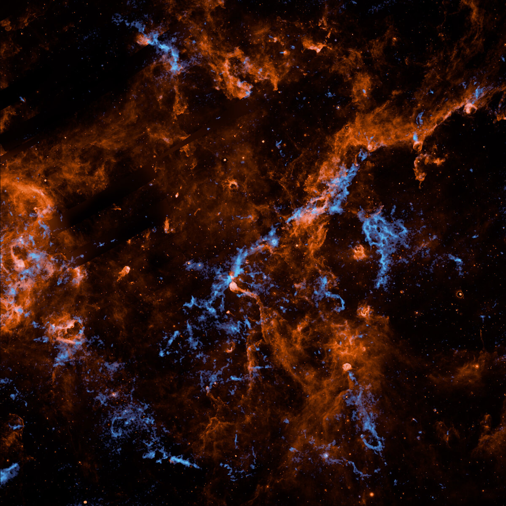

# NASA SPHEREx探测器绘制银河系星际冰图谱

**摘要：** 2026年4月15日，NASA发布了SPHEREx（宇宙历史、再电离时期和冰层光谱探测器）任务拍摄的图像，捕捉到银河系天鹅座X恒星形成区中水冰（蓝色）和多环芳烃（橙色）的化学特征。这一发现有助于科学家理解宇宙中大部分水的形成和存储机制，以及生命化学的基础。

*图片来源：NASA/JPL-Caltech/IPAC/Hora et al.*

## 信息来源（原文）

- [NASA: NASA's SPHEREx Observatory Maps Interstellar Ice in Milky Way](https://www.nasa.gov/image-article/nasas-spherex-observatory-maps-interstellar-ice-in-milky-way/)

NASA的SPHEREx（宇宙历史、再电离时期和冰层光谱探测器）观测到了银河系中最活跃、最动荡的恒星诞生区之一——天鹅座X中水冰（亮蓝色）和多环芳烃（橙色）的化学特征。该图像于2026年4月15日与详细研究论文一同发布。

SPHEREx的主要目标之一是绘制各种类型星际冰的化学特征图谱。这些冰包括水、二氧化碳和一氧化碳等分子，这些分子对生命化学至关重要。科学家认为，这些附着在微小尘埃颗粒表面的冰库是宇宙中大部分水形成和存储的地方。地球海洋中的水、彗星以及其他行星和卫星上的冰都源自这些区域。

SPHEREx于2025年3月11日发射，具有独特的102色光谱观测能力，每个颜色代表不同波长的红外光，能够提供关于星系、恒星、行星形成区和其他宇宙特征的独特信息。

图像来源：NASA/JPL-Caltech/IPAC/Hora et al.
