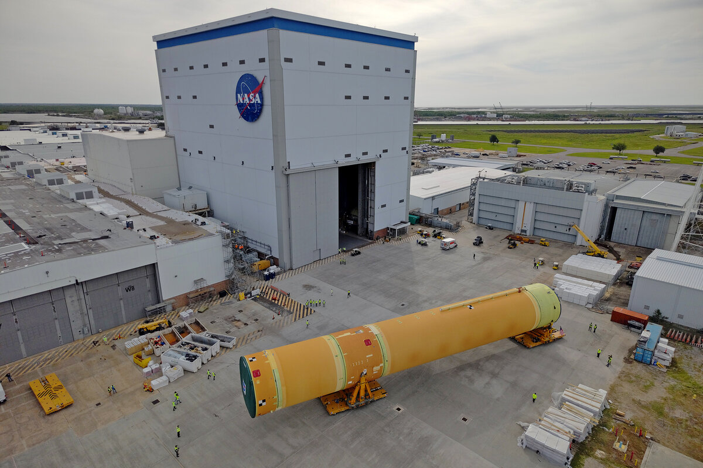

# NASA 展开 Artemis III SLS 火箭芯级，为2027年载人登月任务铺路

**摘要：** 2026年4月20日，NASA将Artemis III载人登月任务使用的SLS（太空发射系统）火箭芯级从路易斯安那州新奥尔良的密谢角装配设施（Michoud Assembly Facility）运出，通过NASA的Pegasus驳船转运至佛罗里达州肯尼迪航天中心。该芯级高212英尺（约65米），将承载超过73.3万加仑的超低温液体推进剂，为四台RS-25发动机提供燃料。此次转运标志着2027年重返月球载人任务取得关键进展。

*图片来源：NASA / Michael DeMocker（公共领域）*

## 任务背景

在Artemis II任务成功完成绕月飞行测试后，NASA加速推进Artemis III准备工作。Artemis III将是自1972年阿波罗17号以来首次载人月球着陆。SLS芯级是Artemis III火箭的支柱，包含液氢储箱、液氧储箱、级间段和前裙部。组装完成后，芯级高度达212英尺，将容纳超过73.3万加仑的超低温液体推进剂，为四台RS-25发动机提供燃料，在发射和飞行过程中产生超过200万磅的推力，将航天员送入轨道。

## 转运作业

4月20日，工程师使用专业运输设备将SLS芯级的上四分之三部分（含两个推进剂储箱、级间段和前裙部）从密谢角装配设施内部转运至Pegasus驳船。运抵肯尼迪航天中心后，团队将完成芯级装备和垂直集成，NASA探索地面系统项目团队将进行火箭各级的堆叠组装，为发射做准备。

## 战略意义

NASA总部探索系统开发任务理事会代理副署长洛里·格莱兹（Lori Glaze）表示："看到SLS火箭硬件运出，让我们强烈感受到我们在重返月球表面方面取得的进展。这是Artemis III的脊梁。随着它前往佛罗里达完成最终集成，我们离测试将美国人送上月球所需的关键能力又近了一步，并为最终将载人任务送上火星铺平道路。"

Artemis III任务目前计划于2027年发射，航天员将搭乘NASA的猎户座飞船在月球南极附近着陆。

## 信息来源（原文）

- [NASA Rolls Out Artemis III Moon Rocket Core Stage - NASA](https://www.nasa.gov/news-release/nasa-rolls-out-artemis-iii-moon-rocket-core-stage/)
- [Artemis III Core Stage Rollout - NASA Image Library](https://images-assets.nasa.gov/image/MAF_20260420_CS3_Rollout_UAS06/MAF_20260420_CS3_Rollout_UAS06~large.jpg)
