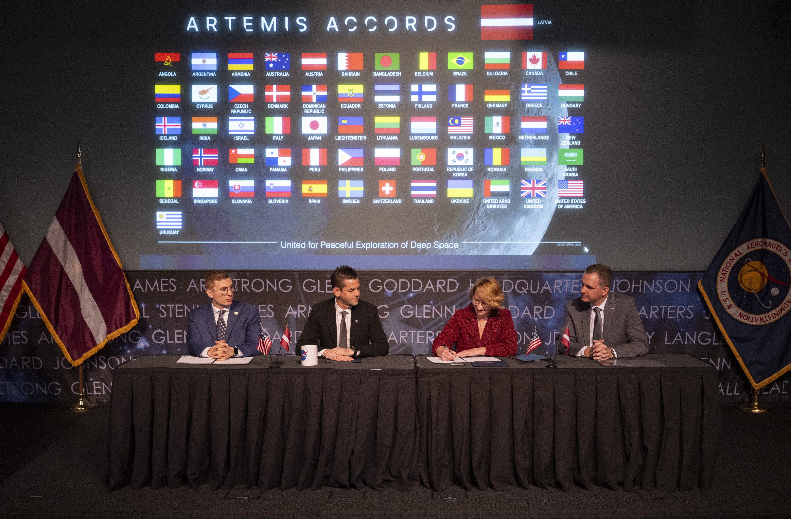

# 拉脱维亚签署《Artemis协定》，成为第62个签署国

**摘要：** 2026年4月20日（星期一），拉脱维亚教育科学部长Dace Melbārde在NASA总部签署《Artemis协定》，正式成为该协定的第62个签署国。NASA局长贾里德·艾萨克曼主持仪式时表示："每一位新签署国的加入，都加强了这个致力于透明、和平探索太空的联盟。"拉脱维亚成为继2026年3月瑞士和巴西之后又一个加入该协定的国家。

*图片来源：NASA / Joel Kowsky（公共领域）*

## 签署仪式

2026年4月20日，拉脱维亚教育科学部长Dace Melbārde在位于华盛顿的NASA总部Mary W. Jackson大楼签署了《Artemis协定》。NASA局长贾里德·艾萨克曼主持仪式，美国国务院负责经济事务的副国务卿Jacob Helberg以及拉脱维亚驻美国大使馆临时代办Jānis Beķeris出席仪式。

NASA局长贾里德·艾萨克曼表示："我们很高兴欢迎拉脱维亚加入《Artemis协定》。每一位新签署国的加入，都加强了这个致力于透明、和平探索太空的联盟。协定是真实任务和月球表面真实合作的基础，拉脱维亚的承诺加强了我们对这个探索新时代的共同愿景。"

Melbārde表示："今天，拉脱维亚与人类共同愿景接轨，以国际合作和和平、透明、负责任的方式探索外层空间。通过加入《Artemis协定》，我们对这些原则做出明确承诺。拉脱维亚已通过其工业和研究为全球太空生态系统做出贡献，我们期待着深化与NASA和国际伙伴的合作。"

## Artemis协定背景

2020年，在特朗普第一届政府时期，美国由NASA和国务院牵头，与其他七个创始国共同建立了《Artemis协定》，旨在应对各国政府和私营公司对月球活动日益增长的兴趣。

《Artemis协定》引入了一套实用原则，旨在加强月球、火星及更远天体上民用太空探索的安全性、透明度和协调性。协定要求签署国承诺：和平探索、互助合作、避免干扰、开放透明、紧急援助、太空资源合法获取、文物保护等原则。

## 协定发展与意义

2026年4月，NASA宣布计划建立常态化、负担得起的月球访问体系，建设持久月球基地并最终建设商业月球经济。在此背景下，Artemis协定的重要性日益凸显。目前全球已有超过40个国家签署了Artemis协定，拉脱维亚成为第62个签署国。

Artemis协定的签署意味着承诺：和平探索、在需要时提供援助、共享科学数据、避免有害活动干扰、遵守登记公约等。NASA表示，预计未来数月和数年内将有更多国家签署Artemis协定。

## 信息来源（原文）

- [NASA: NASA Welcomes Latvia as Newest Artemis Accords Signatory](https://www.nasa.gov/news-release/nasa-welcomes-latvia-as-newest-artemis-accords-signatory/)
