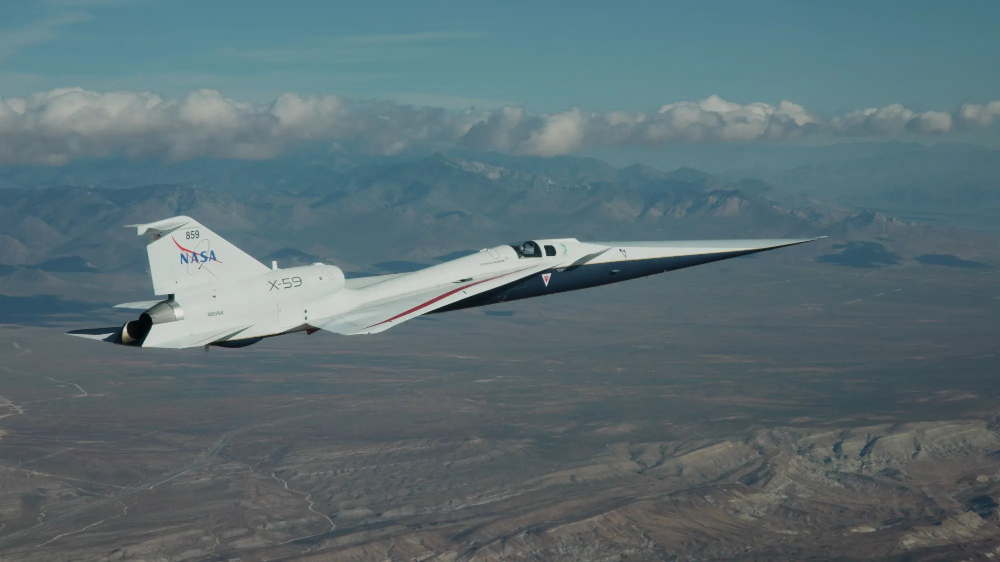

# NASA X-59 静音超音速验证机完成滑行测试

**摘要：** 2026年4月14日，NASA X-59 Quietsupersonic 静音超音速研究验证机在加利福尼亚州莫哈韦沙漠上空完成迄今最高、最快的飞行测试，并成功实现从机轮触地到滑行起飞的过渡。该验证机隶属于 NASA 的 Quesst 任务，旨在证明超音速飞行可不产生震耳雷鸣般的音爆，仅产生柔和的"砰砰"声。

*图片来源：NASA*

X-59 验证机在本次试飞中拓展了运行包线，飞出了该型机迄今最高和最快的飞行高度与速度。在后续试飞中，团队将重点验证飞行控制系统性能、结构载荷与动力学，以及液压、燃油、航空电子、起落架等子系统的运行状态。机载外部视觉系统（eXternal Vision System）——一组位于机身的摄像头替代传统前挡风玻璃——也在测试范围内，其图像实时显示在驾驶舱显示屏上。

Quesst 任务的最终目标是展示技术可行性：超音速飞行（每小时超过 1236 公里）可不产生 Loud 音爆，从而可能改变全球超音速飞行 regulations，使静音超音速客机重返天空成为可能。

## 信息来源（原文）

- [NASA: Wheels Up for X-59](https://www.nasa.gov/image-article/wheels-up-for-x-59/)
