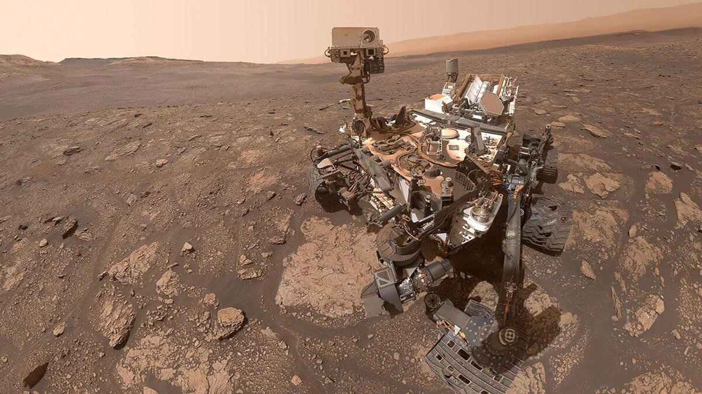

# 好奇号火星车发现火星史上最多样有机分子群

**摘要：** 经过多年的实验室分析，NASA 确认好奇号火星车于 2020 年采集的岩石样本中包含火星有史以来最多样的有机分子群。在识别出的 21 种含碳分子中，有 7 种是首次在火星上被检测到的，其中包括一种被认为是 RNA 和 DNA 前体的氮杂环化合物。

*Credit: NASA/JPL-Caltech/MSSS*

2020 年 10 月 25 日，好奇号从夏普山上一片富含黏土的区域采集了 "Mary Anning 3" 样本。经过多年使用车载 "火星样本分析仪器"（SAM）进行实验室分析，科学家共识别出 21 种不同的含碳有机分子，这是火星上有记录以来最多样化的有机分子集合。

新发现的化合物中，有 7 种此前从未在火星表面或火星陨石中得到确认。其中意义尤为重大的是检测到了氮杂环化合物——一种含氮的分子环状结构，被认为是 RNA 和 DNA 的化学前体，而 RNA 和 DNA 是遗传信息的关键分子。

佛罗里达大学首席作者艾米·威廉姆斯表示："这一发现意义重大，因为这些结构可能是更复杂含氮分子的化学前体。氮杂环化合物此前从未在火星表面被发现，也未在火星陨石中得到确认。"

Mary Anning 采样点之所以被选中，是因为数十亿年前这里曾被湖泊和溪流覆盖。这一古老的水环境形成了大量黏土矿物，而这些矿物特别擅长保存有机化合物——这些遍布太阳系的含碳生命构建单元。

样本使用了"湿化学"技术进行分析，试剂为四甲基氢氧化铵（TMAH），这是一种专用于高价值样本的强力溶剂。Mary Anning 3 样本是火星上首个接受 TMAH 处理分析的样本。科学家还在地球上使用拥有 40 亿年历史的默奇森陨石验证了该技术，确认了分析结果的有效性。

科学家强调，有机分子的存在并不能证明火星上曾存在古老生命——它们既可能由生物过程产生，也可能由地质过程产生。然而，这一发现确实确认了古代火星具备支持生命存在的正确化学条件。

JPL 任务项目科学家阿什温·瓦萨瓦达表示："这是好奇号及其团队的最佳表现。能够定位这个采样点、钻取样本，并凭借我们的杰出机器人做出这些发现，离不开数十位科学家和工程师的努力。这一有机分子群再次增加了火星在远古时代曾经孕育生命的可能性。"

好奇号目前已用完两个 TMAH 试剂杯，正在探索由古老地下水形成的网状箱形脊结构，第二次 TMAH 分析的结果将在未来同行评审论文中发表。

## 信息来源（原文）

- [NASA: Curiosity Finds Organic Molecules Never Seen Before on Mars](https://www.nasa.gov/missions/mars-science-laboratory/curiosity-rover/nasas-curiosity-finds-organic-molecules-never-seen-before-on-mars/)
