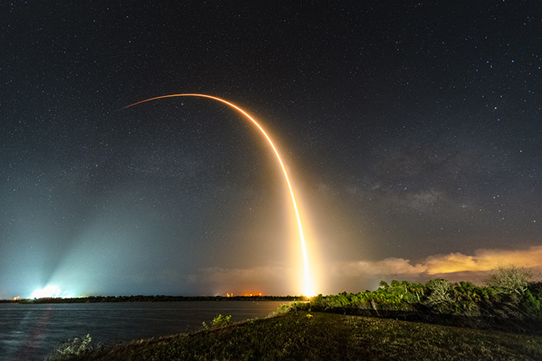

*图片来源：Spaceflight Now*

**摘要：** 2026年4月21日，SpaceX猎鹰9号火箭从卡纳维拉尔角太空军基地40号发射台成功发射美国天军最后一颗GPS III系列卫星——GPS III-8（代号SV10，又名"海迪·拉玛"）。这是GPS III星座建设的重要收官任务。

## 任务概况

卫星于美国东部时间凌晨2时53分25秒（协调世界时6时53分25秒）发射升空，约1.5小时后卫星成功部署至中地球轨道。此次发射原计划于4月20日进行，因回收区天气条件不佳推迟一天。

GPS III-8是GPS III系列的第十颗卫星，也是该系列的最后一颗。该卫星以著名发明家兼影星海迪·拉玛命名，她是跳频技术的先驱发明者。

## GPS III卫星系统

GPS III是全球定位系统的新一代升级星座，相比早期GPS卫星具有更高的精度、抗干扰能力和民用信号兼容性。整代GPS III卫星将显著提升美军和民用GPS服务的性能。

## 信息来源（原文）

- [SpaceX launches final GPS III satellite for the U.S. Space Force (Spaceflight Now)](https://spaceflightnow.com/2026/04/21/live-coverage-spacex-to-launch-final-gps-iii-satellite-for-the-u-s-space-force/)
