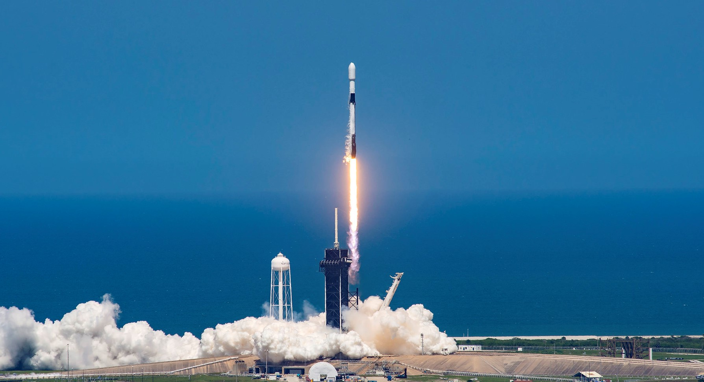

# SpaceX GPS III SV10 发射预告：第十颗 GPS III 卫星即将升空

**摘要：** SpaceX 将于协调世界时（UTC）4 月 21 日 06:53 分（北京时间 14:53）从卡纳维拉尔角太空军基地 40 号发射复合体（LC-40）使用 Falcon 9 火箭发射 GPS III SV10 卫星。GPS III SV10 是 GPS III 星座升级计划的第十颗卫星，将进一步提升美国 GPS 导航系统的精度、信号强度和抗干扰能力。

*Credit: SpaceX / TheSpaceDevs*

## 任务概况

GPS III SV10 是洛·马公司研制的 GPS III 系列导航卫星中的第十颗，也是 GPS III 计划的倒数第二颗卫星（计划共 11 颗）。GPS III 卫星相比前代 GPS IIF 卫星有多项改进：

- **精度提升**：民用信号精度提高至前代的三倍
- **信号强度**：更强的 L1、L2 和 L5 信号，提升抗干扰能力
- **使用寿命**：设计寿命延长至 15 年（前代为 12 年）
- **L5 信号**：新增兼容航空安全的 L5 信号频段

本次发射使用经过多次飞行的 Falcon 9 一级助推器，发射窗口为 06:53 至 07:08 UTC（北京时间 14:53 至 15:08），发射窗口共 15 分钟。

## 发射信息

| 项目 | 详情 |
|------|------|
| 火箭 | Falcon 9 Block 5 |
| 助推器 | 已飞行多次（具体编号待公布） |
| 有效载荷 | GPS III SV10 |
| 发布时间 | 2026-04-21 06:53 UTC |
| 发射窗口 | 06:53–07:08 UTC（15 分钟） |
| 发射场 | 卡纳维拉尔角太空军基地 SLC-40 |
| 轨道 | 中地球轨道（MEO） |
| 整流罩回收 | 否（无整流罩回收任务） |

发射任务状态目前为"Go for Launch"，气象条件关注项包括积云规则和厚云层规则，综合概率 90%。

## GPS III 计划背景

GPS III 是美国空军第三代 GPS 卫星替代计划，旨在替换老旧的 GPS IIR 和 GPS IIF 卫星。全部 11 颗 GPS III 卫星部署完成后，将与现有 GPS IIF 和 GPS III SV01–SV09 共同运行，向全球用户提供定位、导航和授时（PNT）服务。GPS III 卫星由洛·马公司主承包制造，波音和诺斯罗普·格鲁曼参与部分分系统研制。

## 信息来源（原文）

- [GPS III SV10 Launch Details - TheSpaceDevs](https://ll.thespacedevs.com/2.2.0/launch/2c5686ec-b0fd-4987-935d-587e3c85fa2d/)
- [NASA GPS III Mission Overview](https://www.nasa.gov/missions/gps-iii-sv10/)
- [SpaceX Launch Manifest](https://www.spacex.com/launch/)

> 注：GPS III SV10 发射若因天气或技术原因推迟，将在下一个可用窗口重新发射。本报道将随任务进展更新。
