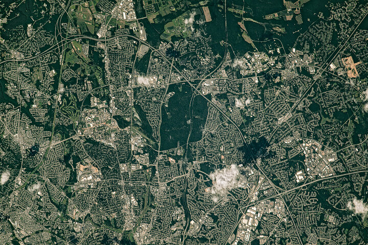

# NASA 地球观测卫星影像：华盛顿郊区绿带

**摘要：** NASA 地球观测台于 2026 年 4 月 22 日发布一张由国际空间站宇航员拍摄的影像，展示马里兰州首都环城公路（Capital Beltway）东北侧绿色空间与城市建成区交织的独特景象，作为当日"每日影像"发布。

*Credit: NASA Earth Observatory / ISS*

影像由国际空间站（ISS）上的宇航员拍摄，呈现了马里兰州首都环城公路（I-495/I-95）东北段沿线的景观。在这条繁忙的环形公路两侧，绿色空间巧妙地穿插于城市建成区之间，形成独特的生态格局。

NASA 地球观测台（Earth Observatory）定期发布由卫星和空间站拍摄的地球影像，帮助公众了解地球表面的变化动态。这张影像作为 4 月 22 日"每日影像"（Image of the Day）发布，呼应当天全球庆祝的地球日主题。

## 信息来源（原文）

- [Belts of Green in the Washington Suburbs - NASA Earth Observatory](https://science.nasa.gov/earth/earth-observatory/belts-of-green-in-the-washington-suburbs/)
