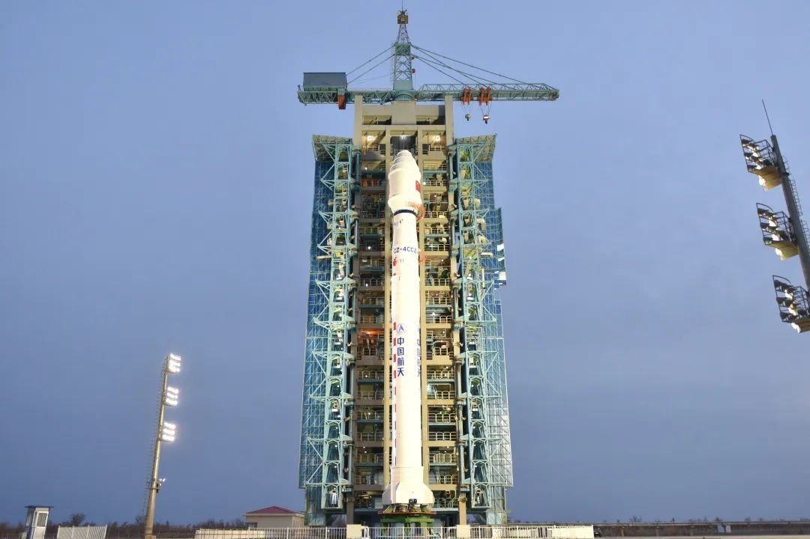

# 长征四号丙成功发射大气环境监测卫星

**摘要：** 北京时间4月17日4时02分，长征四号丙（Long March 4C）运载火箭在酒泉卫星发射中心94号发射工位（SLS-2/603）成功发射大气环境监测卫星Daqi-2（AEMS）。卫星进入预定轨道，发射任务取得圆满成功。Daqi-2是中国的第二代大气环境监测卫星，用于全球大气环境的综合探测。

*Credit: 中国航天科技集团 / 资料图片*

Daqi-2（AEMS，Atmospheric Environment Monitoring Satellite）是中国自主研制的大气环境监测卫星，具备对全球大气成分、温室气体、气溶胶等进行综合探测的能力。卫星数据将用于环境监测、气候变化研究以及大气污染防治等领域的应用。

此次发射是2026年中国航天的又一次成功发射任务，也是长征系列火箭的又一次常态化发射。酒泉卫星发射中心在整个发射过程中表现良好，确保了任务的圆满成功。

## 信息来源（原文）

- [Long March 4C Daqi-2 Launch - TheSpaceDevs](https://ll.thespacedevs.com/2.2.0/launch/?limit=10&window_start__gte=2026-04-15)
- [国家航天局报道](https://www.cnsa.gov.cn/n6758823/n6758838/)
