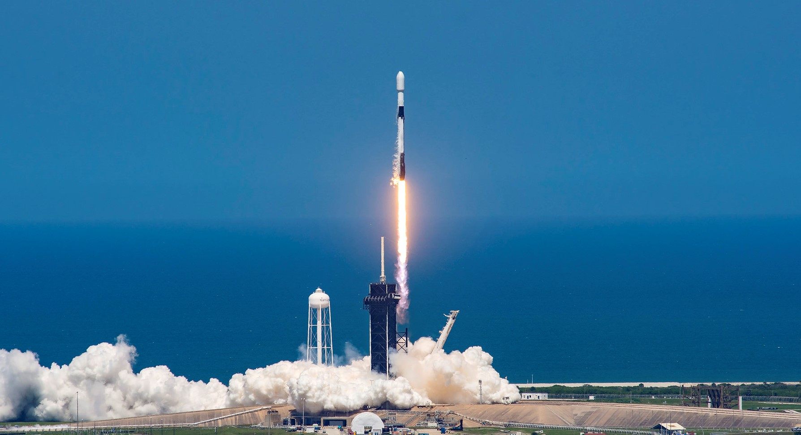

# SpaceX成功发射GPS III SV10卫星

**摘要：** 北京时间4月21日，SpaceX使用猎鹰9号Block 5火箭从卡纳维拉尔角太空军基地成功发射了GPS III SV10卫星。这是美军第三代GPS卫星系列的第十颗卫星，也是该系列在2026年的第四次发射。卫星预计将提升美军GPS系统的精度、抗干扰能力和整体性能。

*Credit: SpaceX / 资料图片*

GPS III SV10是洛克希德·马丁公司制造的第三代GPS卫星之一，相比前代系统具有更高的精度（民用精度从3米提升至1米）、更强的抗干扰能力，以及更长的设计寿命。该卫星将加入现有GPS星座，提升全球导航定位服务的可靠性。

此次发射是SpaceX在2026年的又一次常态化发射任务。猎鹰9号第一级助推器在发射后成功回收，降落于卡纳维拉尔角的着陆区。

## 信息来源（原文）

- [GPS III SV10 Launch - TheSpaceDevs](https://ll.thespacedevs.com/2.2.0/launch/?limit=10&window_start__gte=2026-04-20)
- [SpaceX官方任务页面](https://www.spacex.com/launches/)
