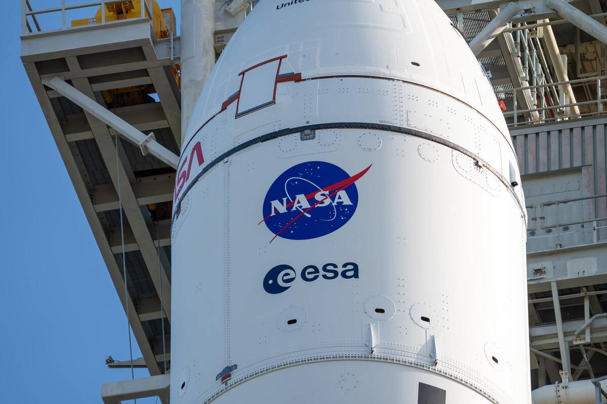

# 英飞凌抗辐射半导体在 Artemis II 任务中通过太空验证

**摘要：** NASA 的 Artemis II 任务已成功返回地球，此次任务不仅完成了超越地球轨道的深空探索，还为太空船机载电子设备提供了重要的实际验证。全球半导体巨头英飞凌发布报告称，其为猎户座飞船提供的抗辐射半导体在任务期间保持零故障运行，成功支持了电源管理、系统控制和数据通信等核心功能。

*Credit: NASA（公共领域）*

## 信息来源（原文）

- [英飞凌抗辐射半导体助力 Artemis II 任务成功返回地球](https://finance.sina.com.cn/tech/roll/2026-04-22/doc-inhvitaq4506255.shtml)

> 英飞凌科技官方报告，2026年4月22日。
