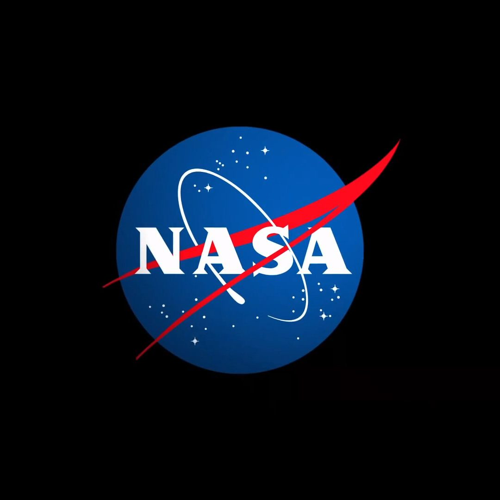

# 约旦将于 4 月 23 日签署《 Artemis 协议》

**摘要：** 约旦哈希姆王国将于 2026 年 4 月 23 日（周四）上午 9:30（美国东部时间）在美国华盛顿 NASA 总部举行仪式，正式签署《 Artemis 协议》。NASA 局长 Jared Isaacman 将与约旦驻美国大使 Dina Kawar 及美国国务院海洋与国际环境科学事务副助理国务卿 Ruth Perry 共同出席。这将是《 Artemis 协议》签署的第 50 余个国家和地区。

*Credit: NASA*

## 信息来源（原文）

- [NASA Invites Media to Jordan Artemis Accords Signing Ceremony](https://www.nasa.gov/news-release/nasa-invites-media-to-jordan-artemis-accords-signing-ceremony/)

> 《 Artemis 协议》确立了太空探索行为的最佳实践原则，包括和平目的、透明度和数据共享等，已获得全球广泛支持。
