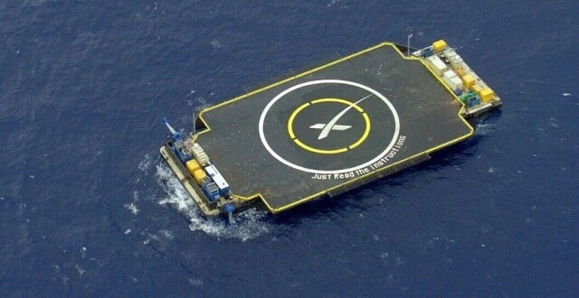

# SpaceX 无人回收船 JRTI 完成第 156 次猎鹰火箭回收

**摘要：** 2026年4月21日，SpaceX 猎鹰9号火箭从卡纳维拉尔角成功发射 GPS III SV10 卫星。一级助推器 B1095.7 在发射后约 8 分半降落在停泊于大西洋的无人回收船「请看说明书」（Just Read the Instructions，简称 JRTI）甲板上，完成第 7 次飞行与回收，同时使 JRTI 的总回收纪录定格在第 156 次。SpaceX 官方随后宣布，JRTI 将不再承担猎鹰9号回收任务，未来将全面转向支持星舰（Starship）运营。

*Credit: SpaceX / 资料图片*

SpaceX 目前运营三艘无人回收船：「当然我还爱你」（Of Course I Still Love You，OCISLY）部署于卡纳维拉尔角沿海，「请看说明书」（JRTI）同样部署于东海岸，另一艘「缺乏引力」（A Shortfall of Gravitas，ASOG）部署于西海岸。三艘船累计已完成数百次火箭助推器回收，使猎鹰系列火箭成为人类历史上复用率最高的运载火箭系统。

JRTI 的这次回收具有特殊的历史意义——它是 JRTI 执行的最后一次猎鹰9号回收任务。随着 SpaceX 将资源转向星舰计划，未来 JRTI 将与 OCISLY 一起为星舰的超重助推器（Super Heavy Booster）提供回收支持，标志着 SpaceX 回收能力的又一次重大升级。

GPS III SV10 是洛克希德·马丁公司制造的第三代 GPS 卫星第十颗星，由猎鹰9号 Block 5 火箭送入预定轨道。此次发射是 SpaceX 在 2026 年的第 48 次猎鹰系列火箭发射。

## 信息来源（原文）

- [腾讯新闻：SpaceX 猎鹰9号发射 GPS III SV10 卫星](https://new.qq.com/rain/a/20260421A06TVG00)
