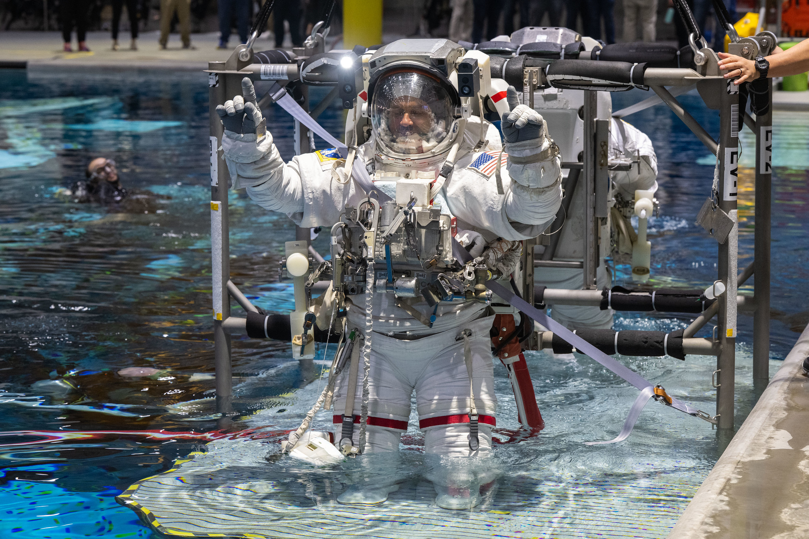

# NASA宣布宇航员Anil Menon新闻发布会，预告即将执行的国际空间站任务

**摘要：** NASA宣布将于4月29日（星期三）下午1点45分（美东时间）在休斯顿约翰逊航天中心举办新闻发布会，宇航员Anil Menon将出席并介绍其即将执行的国际空间站任务。届时NASA将在YouTube频道进行直播。

*Credit: NASA*

## 信息来源（原文）

- [NASA Astronaut Anil Menon to Discuss Upcoming Launch, Mission](https://www.nasa.gov/news-release/nasa-astronaut-anil-menon-to-discuss-upcoming-launch-mission/)
