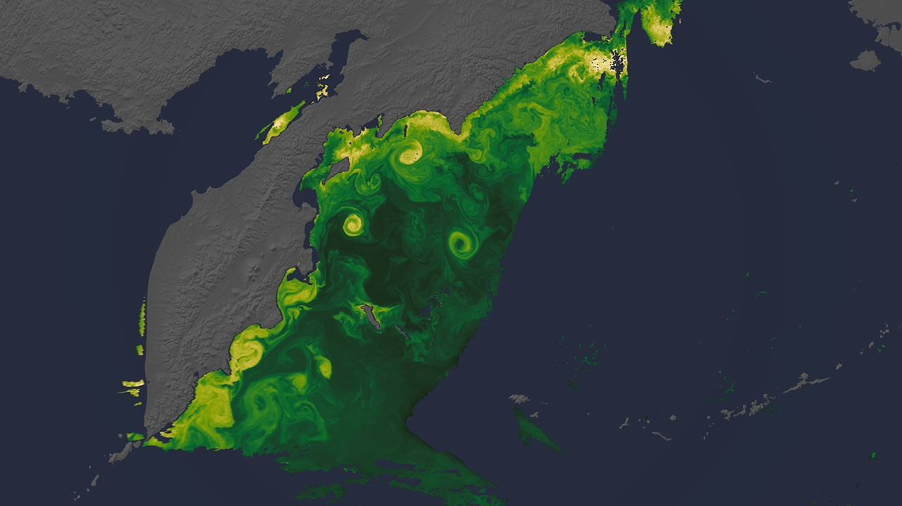

# NASA 发布 Artemis II 任务期间地球新影像：浮游植物与极光同框

**摘要：** 2026年4月21日，NASA 发布了一组由 Artemis II 任务期间拍摄的地球影像，记录了从月球轨道视角看到的独特地球画面。这批照片由 NASA 多个地球观测卫星联合捕捉，展示了堪察加半岛沿海的浮游植物水华、极光以及地球大气层的动态变化，为科学家提供了前所未有的研究素材。

*Credit: NASA（公共领域）*

## 影像内容

这批发布的地球影像主要包含以下内容：

- **浮游植物水华**：堪察加半岛沿海春季形成的浮游植物大量繁殖景观，这一现象在海洋生态系统中扮演着重要角色，帮助碳循环并支撑海洋生物链
- **极光影像**：从太空视角拍摄的极光画面，展示地球磁场与太阳风的相互作用
- **大气层动态**：云层和大气现象的全球视角图像

## 任务背景

Artemis II 于 2026年4月1日发射，在执行约10天的绕月飞行任务期间，航天员不仅专注于月球探索使命，同时借助船上仪器和地面卫星系统，捕捉了大量地球观测数据。这些影像与数据由 NASA 戈达德太空飞行中心（Goddard Space Flight Center）负责处理和发布。

## 科学价值

NASA 地球科学部（Earth Science Division）表示，这些影像不仅具有极高的美学价值，更蕴含丰富的科学研究意义。通过分析这些同期观测数据，科学家能够更深入理解：

- 海洋生态系统的季节性变化
- 极光形成机制与太阳活动的关系
- 地球大气层的全球能量平衡

## 信息来源（原文）

- [New NASA Views of Earth, From (S)PACE - NASA Science](https://science.nasa.gov/earth/new-nasa-views-of-earth-from-space/)
