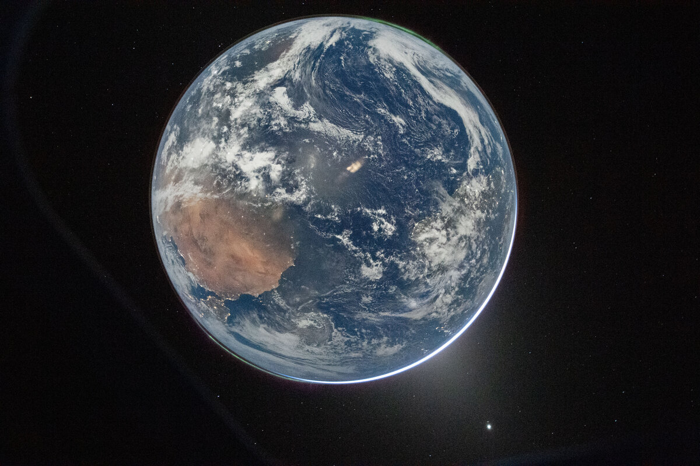

# NASA 在第 30 届 Webby 奖评选中斩获两项大奖及五项人民之声奖

**摘要：** 2026 年 4 月 21 日，NASA 在第 30 届年度 Webby 奖评选中荣获两项 Webby 大奖及五项人民之声奖（People's Voice Awards）。Webby 奖被誉为"互联网最高荣誉"，NASA 的获奖展示了该机构在数字传播、在线内容和公众互动领域的持续领先地位。

*Credit: NASA（公共领域）*

## NASA 数字传播实力获认可

Webby 奖由国际数字艺术与科学学院（International Academy of Digital Arts and Sciences）每年颁发，是互联网领域最负盛名的荣誉之一。NASA 在第 30 届年度 Webby 奖评选中斩获多项大奖，凸显了该机构在科学传播和公众科普方面的不懈努力与卓越成就。

五项人民之声奖由公众投票选出，体现了公众对 NASA 在线内容的高度认可，以及 NASA 致力于让每个人都能感受太空与科学魅力的坚定承诺。

## NASA 2026 年 Webby 奖完整获奖名单

NASA 的获奖内容涵盖多个领域：

- **科学教育**：以交互式多媒体内容阐释 NASA 复杂任务的科普专题
- **地球科学传播**：来自 NASA 地球观测卫星的更新和影像
- **社交媒体与科普**：NASA 在各数字平台上的公众互动，包括网站、社交媒体和多媒体内容

## 关于 Webby 奖

Webby 奖由国际数字艺术与科学学院主办，该学院由技术先驱、艺术家和文化领袖组成的全球性组织。奖项涵盖网站、广告、媒体、移动应用和在线视频内容等多个类别。人民之声奖（People's Voice Awards）与主要 Webby 奖同期举行，由公众投票决定。

NASA 在 Webby 奖评选中持续获得认可，反映了该机构长期致力于以创新方式使其任务、研究和发现触手可及。

## 信息来源（原文）

- [NASA Wins Two Webby Awards, Five Webby People's Voice Awards — NASA](https://www.nasa.gov/general/nasa-wins-two-webby-awards-five-webby-peoples-voice-awards/)
- [The Webby Awards Official Website](https://www.webbyawards.com/)

> 第 30 届年度 Webby 奖颁奖典礼于 2026 年举行，表彰过去一年互联网上最具创新性的内容。NASA 凭借其数字传播和科学普及工作，已多次在 Webby 奖评选中获奖。
