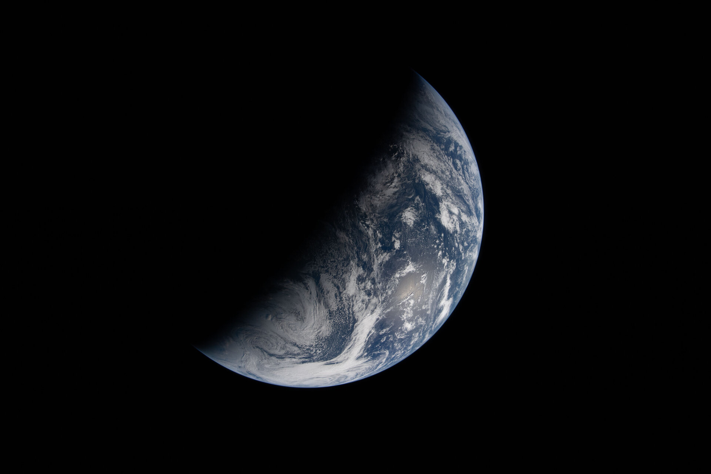

# NASA 公布 Artemis II 任务拍摄的地球明暗界线影像

**摘要：** NASA 于 2026 年 4 月 22 日（地球日）发布由 Artemis II 宇航员在绕月飞行期间拍摄的地球影像，展示明暗界线——即昼半球与夜半球交界处——的壮观的景象。这张影像由宇航员于 4 月 2 日拍摄，生动呈现了我们家园星球的独特视角。

*Credit: NASA*

2026 年 4 月 2 日，Artemis II 任务的宇航员们在前往月球途中，捕捉到了这一独特的地球视角。影像中清晰可见地球上的明暗界线——昼夜交替的边界线，这条线将地球的昼半球与夜半球分开。

NASA 表示，这张影像作为地球日献礼发布，彰显了 NASA 科学团队每日致力于改善地球生命的承诺。NASA 从太空获取的关于地球的洞察，为决策者提供了宝贵的卫星数据。

Artemis II 是 NASA Artemis 计划的首次载人绕月飞行任务，将验证猎户座飞船在深空环境下的性能，为后续 Artemis III 载人登月任务奠定基础。

## 信息来源（原文）

- [Night and (Earth) Day - NASA](https://www.nasa.gov/image-article/night-and-earth-day/)
