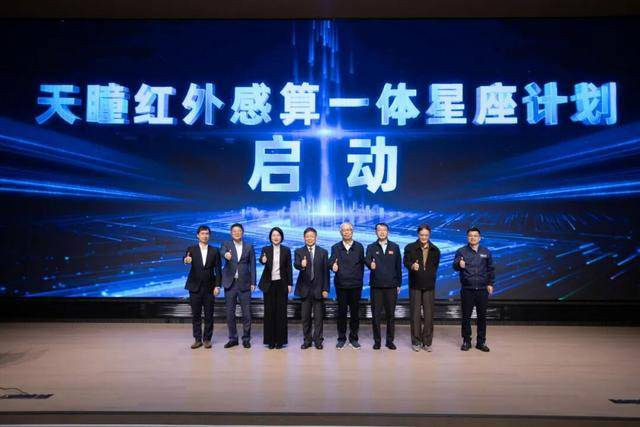

# 天瞳星座正式启动：国内首个220颗红外卫星组网规划发布

**摘要：** 4月22日，首届"天瞳"红外卫星产业发展大会在上海闵行区中国商业火箭总部园区举行。会上，蔚星科技正式宣布启动由220颗红外卫星组成的天瞳星座，这是国内首个规划达220颗规模的商业红外卫星星座。该星座采用感算一体设计，搭载首创的先进红外载荷技术，可实现目标秒级识别、分钟级预警，计划今年年底发射首批10颗卫星，2030年完成全星座组网。

*图片来源：澎湃新闻*

会上，蔚星科技正式入驻中国商业火箭总部园区，并同步发布"天基大脑"产品体系，包含"星火""星鉴""星镜"三款产品，分别聚焦林草防火、海外资产智能盘点与水环境治理三大应用场景。

## 感算一体：红外卫星新范式

天瞳星座最核心的技术创新在于"感算一体"设计——在卫星上实现红外探测与星上实时数据处理的深度融合。与传统制冷型红外探测器相比，蔚星科技作为国内首家将非制冷红外探测器用于卫星的商业航天公司，突破了非制冷红外探测在轨应用的多项关键技术，通过算法模型规避噪声干扰，有效提高了信噪比和探测能力。

"我们既然是做商业航天，就要解决成本问题。"蔚星科技首席数据官万林涛介绍，团队"摸清了非制冷红外探测器在轨工作的特性"，配合自研算法，实现了在低成本条件下仍可满足商业化应用需求的探测性能。此外，公司还在探索用碳纤维替代更多卫星结构件，以进一步减轻整星重量、降低发射成本。

## 应用场景：山火秒级识别

以山火监测为例，传统卫星往往要等到火势蔓延到较大规模才能发现，而天瞳星座通过联动高低轨红外卫星数据，实现"边扫描、边拍摄、边识别"的全链路处理，可精准识别10米级小火点，完成灾前预警、灾中推演与灾后评估的全流程支撑，将监测频率提升至15分钟一次。

## 组网规划：年底首发、2030年收官

蔚星科技预计今年年底发射首轨10颗卫星，力争在1至2年内完成天瞳星座第一期共28颗卫星的发射任务，在"十五五"期间（2026-2030年）完成全部220多颗卫星的组网。届时，天瞳星座将实现全球高频次红外监测能力，为应急防灾、生态环境、海洋监测等领域提供高时效、低成本的红外观测数据服务。

## 天基大脑产品体系发布

会上同步发布的"天基大脑"产品体系是蔚星科技基于天瞳星座数据打造的智能化应用平台：
- **星火**：聚焦林草防火场景，提供实时火点监测与预警；
- **星鉴**：面向海外资产盘点需求，提供基于红外遥感的智能化监测服务；
- **星镜**：专注水环境治理，开展水体污染与生态变化监测。

蔚星科技是中国第一批商业航天企业，由中科院院士王建宇担任技术委员会主任，原中科院上海微小卫星工程中心主任沈学民担任董事长兼首席技术官。公司已成功发射"星环号"等红外卫星，积累了商业红外卫星研制与运营的成熟经验。

## 信息来源（原文）

- [220颗卫星的"天瞳星座"建设开始启动（东方财富网）](https://finance.eastmoney.com/a/202604243716823258.html)
- ["火箭星城"再添新成员！今年首发10颗红外卫星（澎湃新闻）](https://www.thepaper.cn/newsDetail_forward_33033142)
- ["火箭星城"再添新成员！今年首发10颗红外卫星（搜狐）](https://www.sohu.com/a/1013136681_121820044)
