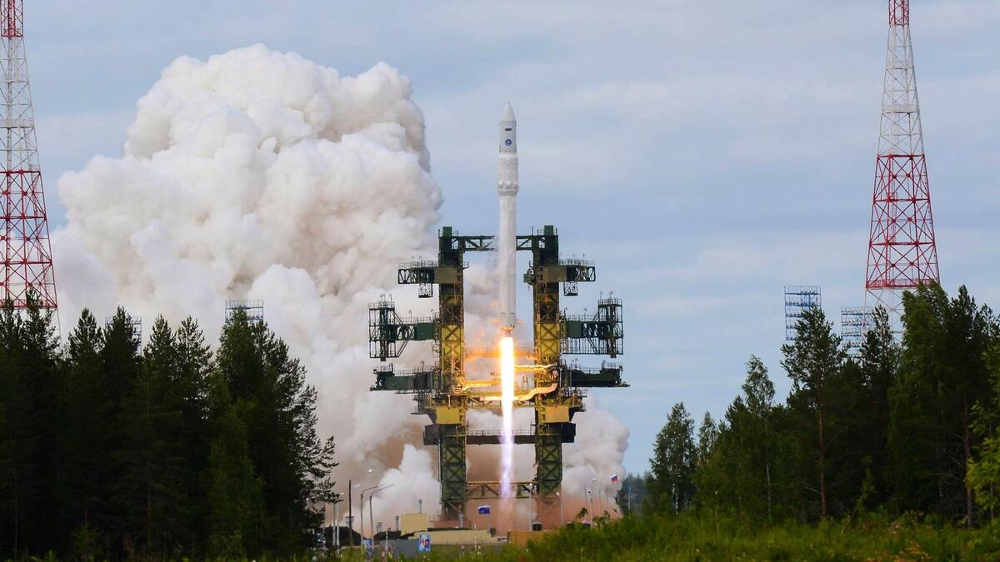

# 俄罗斯安加拉-1.2 火箭成功发射军用卫星

**摘要：** 莫斯科时间 2026 年 4 月 23 日 11 时 29 分，俄罗斯空天军从阿尔汉格尔斯克州的普列谢茨克航天发射场成功发射一枚安加拉-1.2（Angara-1.2）轻型运载火箭，搭载的军用卫星已进入预定轨道，由空天军太空部队地面设备接管控制。

*图片来源：俄罗斯卫星通讯社 / Sputnik*

## 信息来源（原文）

- [俄罗斯国防部：搭载军用卫星的"安加拉-1.2"火箭从普列谢茨克发射场发射](https://sputniknews.cn/20260423/1070925807.html)
- [俄"安加拉-1.2"运载火箭搭载军用卫星发射升空](https://www.cls.cn/detail/2353615)

> 俄罗斯国防部官方通报，莫斯科时间 2026 年 4 月 23 日。
