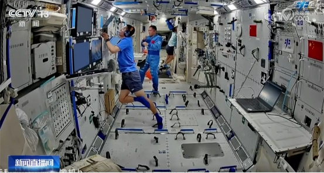

# 2026年中国航天大会（CSC2026）在成都开幕

**摘要：** 2026年4月23日，2026年中国航天大会（CSC2026）在四川成都世纪城新国际会展中心正式开幕。本次大会以「七秩问天路 携手探九霄」为主题，恰逢中国航天事业创建70周年。大会将举办30余场活动，汇聚来自27个国家、地区和国际组织的航天机构代表与专家学者，围绕商业航天模式创新等前沿议题展开高端对话。

*Credit: 中国宇航学会 / 资料图片*

## 信息来源（原文）

- [国家级航天盛典将在成都开幕 - 澎湃新闻](https://www.thepaper.cn/newsDetail_forward_33028708)
- [2026年中国航天大会（CSC2026）通知 - 中国宇航学会](https://new.qq.com/rain/a/20260406A01UZ600)

> 2026年中国航天大会（CSC2026）于4月23日在成都开幕，主题「七秩问天路 携手探九霄」，中国航天事业创建70周年。

## 大会背景

2026年中国航天大会（China Space Conference, CSC2026）由中国宇航学会和中国航天基金会联合主办，创办于2018年，是我国航天领域具有广泛影响力的综合性行业盛会。2026年正值中国航天事业创建70周年，也是「十五五」规划开局之年，本届大会具有承前启后的重要历史意义。

## 大会规模

大会于**4月23日至26日**在成都世纪城新国际会展中心、世纪城国际会议中心及四川大学等地点举办，汇聚了来自**27个国家、地区和国际组织**的航天机构代表与专家学者。

大会安排了**30余场形式多样的活动**，覆盖：

- **学术论坛**：1个主论坛及20余场学术分论坛
- **商业航天**：产业对接与市场研讨
- **青年专场**：青年人才交流
- **科普活动**：航天科普进校园
- **文化交流**：航天文化艺术论坛

## 中国航天日即将到来

大会开幕次日（4月24日），第11个「中国航天日」主场活动将在成都世纪城国际展览中心正式启动。航天日启动仪式上将发布主题宣传片、主题曲，公布2026年「中国航天公益形象大使」，颁发2025年度中国航天基金会钱学森最高成就奖、杰出贡献奖及创新团队奖等奖项，并将发布深空探测、商业航天以及嫦娥五号月球样品研究最新成果等重大信息。

巴西受邀担任本次中国航天日活动主宾国。

## 大会热点议题

据透露，本届大会将围绕以下前沿议题展开讨论：

- **商业航天模式创新**：商业模式与市场前景
- **可回收火箭技术**：长征十号乙、朱雀三号等型号进展
- **深空探测规划**：天问二号小行星探测任务
- **中国空间站应用**：神舟二十三号任务展望
- **卫星互联网建设**：千帆星座、国网星座等低轨部署
- **国际航天合作**：中欧SMILE卫星、中巴地球资源卫星等

## 近期中国商业航天动态

4月下旬起，中国可回收火箭进入密集验证阶段：

| 火箭 | 计划时间 | 亮点 |
|------|---------|------|
| 长征十号乙 | 4月28日 | 首飞，验证海上网系回收技术 |
| 朱雀三号遥二 | 二季度内 | 再次冲刺一子级垂直回收 |

此外，千帆星座（GW AO）、国网星座等低轨卫星互联网建设进入规模化组网期。
