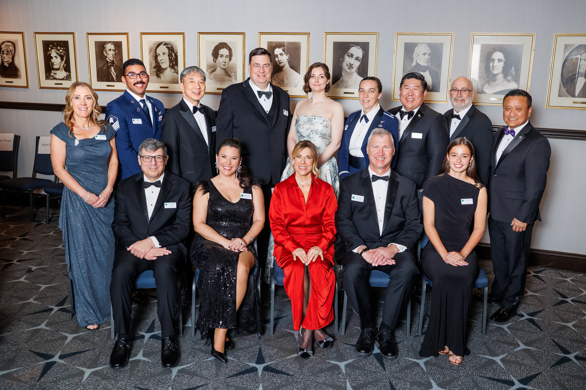

# NASA约翰逊航天中心两位领导者获国家太空俱乐部表彰

**摘要：** NASA约翰逊航天中心两位杰出领导者因其对人体载人航天事业的卓越贡献，荣获国家太空俱乐部与基金会表彰。这是对他们多年来在美国载人航天计划中发挥重要作用的肯定。

*Credit: NASA*

国家太空俱乐部与基金会（National Space Club & Foundation）是美国航天领域历史悠久的荣誉机构，每年表彰为美国航天事业做出突出贡献的个人和团队。此次获奖体现了约翰逊航天中心领导者在国际载人航天合作、任务规划及航天员培养等方面的持续努力。

约翰逊航天中心负责NASA载人航天任务的总体管理，包括国际空间站运营、猎户座飞船开发以及未来深空探测任务的规划工作。

## 信息来源（原文）

- [Johnson Leaders Honored by National Space Club & Foundation](https://www.nasa.gov/centers-and-facilities/johnson/johnson-leaders-honored-by-national-space-club-foundation/)
