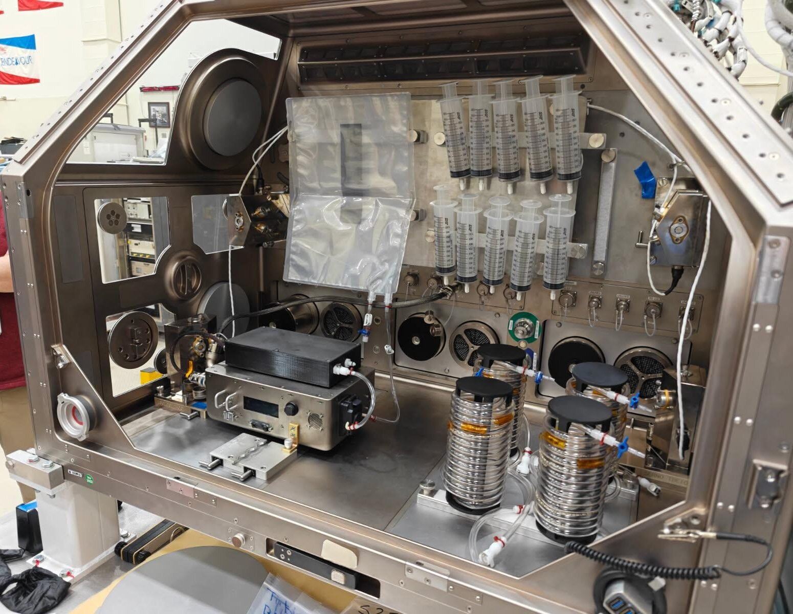

# NASA 在国际空间站测试 IVGEN Mini 系统实现太空输液即时生产

**摘要：** NASA 于 2026 年 4 月在国际空间站成功演示了 IVGEN Mini 系统，该设备可利用空间站饮用水实时生产静脉输液（IV）。这项技术解决了深空任务面临的关键医学难题——目前预包装 IV 输液保质期仅 16 个月，而前往火星等任务可持续长达三年。系统每小时可生产 1.2 升 IV 输液，是人类深空探索医学保障的重要里程碑。

*图片来源：NASA（公共领域）*

IVGEN Mini 系统于 2026 年 4 月在国际空间站进行了操作演示，宇航员在两天内生产了 10 升 IV 输液。系统通过连接空间站饮用水供应，将水过滤去除颗粒和矿物离子后，流入含有预称量氯化钠的输出袋，最终生成可供医疗使用的无菌输液。

## 为什么 IVGEN Mini 对深空探索至关重要

当前载人任务携带的预包装 IV 输液适用于近地轨道任务，但对于长期深空任务而言并不实际——输液保质期有限，在长达三年的火星之旅中将会过期失效。IVGEN Mini 通过按需生产新鲜 IV 输液来解决这一难题，既减轻了货运重量，又确保了医疗物资在整个任务期间保持有效。

NASA 格伦研究中心项目经理 Courtney Schkurko 表示："发射后，我们计划于 5 月进行初步操作。国际空间站上的宇航员将操作 IVGEN Mini，历时两天生产 10 升液体。"

当前系统每小时可生产 1.2 升 IV 输液，这一速度满足了基于深空任务可能发生的医疗事件分析以及输液需求速度所确定的要求。

## 从早期设计演进而来的紧凑解决方案

IVGEN Mini 是该技术的第二代产品。第一代 IVGEN 于 2010 年在国际空间站上进行了演示，但因需要额外的传感设备来验证系统性能而体积较大。

Schkurko 解释道："使用 IVGEN Mini，我们减小了系统的尺寸和重量。前代系统使用气态氮来泵送液体通过系统，而现在我们有了小型化的泵，使我们能够优化设计并完善过滤过程。"

尺寸和重量的减小对于深空任务尤为重要，因为在那些任务中每一公斤货物都必须慎重考虑。

## 为火星及更远任务提供保障

IVGEN Mini 由 NASA 火星计划办公室管理，是为实现月球和火星人类探索而开发的众多技术之一。该系统解决了在地球以外的世界维持宇航员健康的众多后勤挑战之一。

Schkurko 说："在火星任务中，如果你需要携带 100 升 IV 液体，这 100 袋一升装的液体将占用大量空间，而 IVGEN Mini 所占空间要小得多。这就是在携带可能在任务期间过期的输液袋和携带一个可以按需生产的小型设备之间进行权衡。"

IVGEN Mini 团队目前正在计划对该系统生产的 IV 输液进行保质期测试，作为技术成熟化的下一阶段工作。

## 信息来源（原文）

- [Liquid Lifeline: NASA Tech Could Create IV Fluid In Space](https://www.nasa.gov/general/iv-fluid-in-space/)
