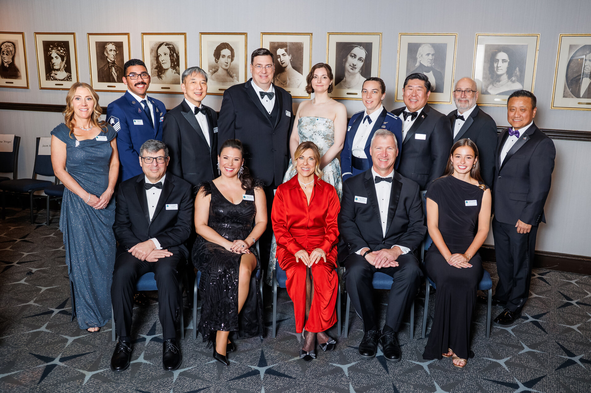

# NASA 约翰逊中心两位领导人获国家太空俱乐部表彰

**摘要：** 2026年3月13日，美国国家太空俱乐部与基金会在华盛顿希尔顿酒店举办的第69届年度罗伯特·H·戈达德纪念晚宴上宣布2026年度获奖者。NASA 约翰逊航天中心两位领导人获得表彰：猎户座项目总监 Howard Hu 获"诺曼·L·贝克航天工程奖"（Norman L. Baker Astronautics Engineer Award），以表彰其在多项载人航天任务中的持续技术贡献。

*Credit: National Space Club & Foundation*

## 获奖详情

第69届罗伯特·H·戈达德纪念晚宴于2026年3月13日在美国华盛顿举行。国家太空俱乐部与基金会借此机会表彰对美国航天事业做出杰出贡献的个人和团队。

**Howard Hu** 作为 NASA 猎户座项目总监，负责 NASA 阿尔忒弥斯登月任务的核心飞船设计、开发、生产和运营工作。猎户座飞船是 NASA 阿尔忒弥斯计划的关键组成部分，旨在将宇航员送往月球并最终送往火星。Howard Hu 因在多项载人航天任务中的持续技术贡献而获奖。

此外，另一位约翰逊航天中心领导人也同时获得表彰。

## 背景意义

国家太空俱乐部与基金会设立的罗伯特·H·戈达德纪念奖旨在纪念美国火箭之父罗伯特·H·戈达德，并表彰为美国航天事业做出突出贡献的个人。该奖项在航天界享有崇高声誉，历届获奖者均为航天领域的杰出领袖和工程师。

Howard Hu 此次获奖，体现了 NASA 在阿尔忒弥斯计划中取得的成就获得了业界广泛认可，也彰显了约翰逊航天中心在人类太空探索中的核心地位。

## 信息来源（原文）

- [Johnson Leaders Honored by National Space Club & Foundation - NASA](https://www.nasa.gov/centers-and-facilities/johnson/johnson-leaders-honored-by-national-space-club-foundation/)
