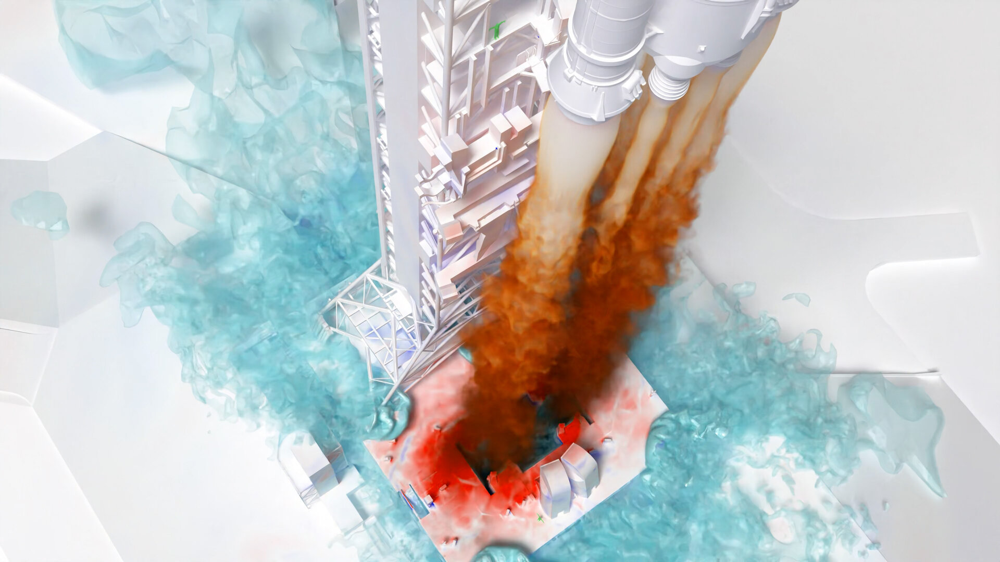

# NASA发布LAVA航空软件助力美国航空航天工业

**摘要：** NASA将其内部使用多年的Launch, Ascent, and Vehicle Aerodynamics（LAVA）航空软件公开发布给美国航空航天工业使用。该软件主要用于解决超燃冲压发动机等先进飞行器的气动设计难题，此前已在NASA内部应用多年并经过大量验证。

*Credit: NASA*

## 信息来源（原文）

- [NASA's LAVA Software Released to US Aerospace Industry](https://www.nasa.gov/aeronautics/nasa-releases-powerful-lava-software-to-us-aerospace-industry/)
