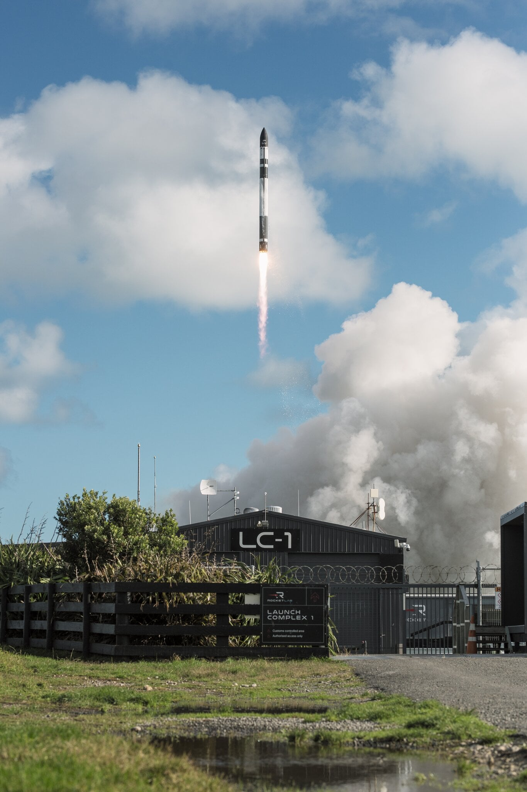

# Rocket Lab完成第85次发射暨首次为欧空局执行专用发射任务

**摘要：** 2026年4月23日，Rocket Lab在新西兰马希亚半岛1号发射场（Rocket Lab Launch Complex 1）成功完成Electron火箭第85次发射任务，将日本JAXA的Kakushin Rising共享卫星送入轨道。此次任务是Rocket Lab首次为欧洲航天局（ESA）执行的专用发射任务，具有里程碑意义。

*Credit: Rocket Lab USA*

## 任务概况

代号为"Kakushin Rising"的这次发射是Rocket Lab第85次Electron火箭发射任务，也是该公司首次为欧洲航天局执行的专用发射任务。Kakushin Rising是日本宇宙航空研究开发机构（JAXA）的共享卫星项目，通过Electron火箭的多载荷适配能力将多颗小卫星送入太空。

Rocket Lab于2026年4月23日协调世界时（UTC）从新西兰马希亚半岛发射台完成发射，火箭正常飞行并将有效载荷精确送入预定轨道。

## 背景意义

此次发射延续了Rocket Lab自2017年以来的高频发射节奏。Electron火箭以其小体积、高频率发射能力在全球小卫星市场占据重要地位。Kakushin Rising任务的成功标志着Rocket Lab进一步拓展了其在国际航天市场的服务范围。

## 信息来源（原文）

- [Rocket Lab Successfully Launches 85th Mission and First Dedicated Launch for European Space Agency](https://www.rocketlabusa.com/updates/rocket-lab-successfully-launches-85th-mission-and-first-dedicated-launch-for-european-space-agency/)
- [TheSpaceDevs Launch Database - Electron Kakushin Rising](https://ll.thespacedevs.com/)
