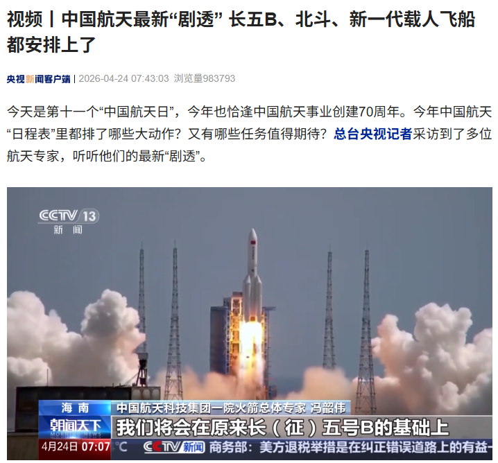

# 嫦娥七号将于年内发射，开启月球极区探测新篇章

**摘要：** 4月24日第十一个"中国航天日"之际，国家航天局宣布嫦娥七号将于2026年年内发射，执行月球极区探测任务。这是中国探月工程四期的核心任务，将对月球南极可能存在的水冰资源进行详细探测。

*图片来源：国家航天局*

2026年4月24日，在四川省成都市举行的第十一个"中国航天日"主场活动启动仪式上，国家航天局重磅宣布：**嫦娥七号将于2026年年内发射**，执行月球极区探测任务。

## 主要任务目标

嫦娥七号是中国探月工程四期的核心组成部分，其主要科学目标包括：

- **月球极区水冰资源探测**：重点对月球南极永久阴影区进行详细勘察，寻找可能存在的水冰资源
- **月表物质成分分析**：对极区月壤和岩石进行系统性分析
- **月球南极环境探测**：测量极区的温度分布、辐射环境等关键参数
- **高精度地形测绘**：获取月球极区高精度三维地形数据

## 技术特点

据中国航天科技集团一院火箭总体专家冯韶伟介绍，嫦娥七号将采用长征五号B运载火箭发射。嫦娥七号探测器将携带多种科学载荷，包括：

- 月球矿物光谱分析仪
- 月球水冰探测仪
- 月球极区环境监测仪
- 高分辨率立体相机

## 探月工程四期规划

嫦娥七号是探月工程四期的第二步。工程四期规划如下：

| 任务 | 目标 | 状态 |
|------|------|------|
| 嫦娥六号 | 月球背面采样返回 | ✅ 已完成 |
| **嫦娥七号** | **月球极区探测** | **即将发射** |
| 嫦娥八号 | 月球资源原位利用技术验证 | 规划中 |

## 科学意义

月球南极被认为是人类未来建立月球基地的最佳区域之一，该区域永久阴影区中可能存在大量水冰资源，可为未来长期驻月提供关键生存物资。嫦娥七号的详细勘察将为后续月球基地建设提供重要科学依据。

此外，嫦娥七号任务还将开展国际合作，携带多台国际载荷参与探测，体现了中国航天开放合作的一贯理念。

> 背景：2026年是中国航天事业创建70周年，也是第十一个"中国航天日"。今年航天日主题为"七秩问天路 携手探九霄"。

## 信息来源（原文）

- [IT之家：嫦娥七号将于年内发射](https://www.ithome.com/0/942/856.htm)
- [新华网：嫦娥七号将于年内发射](https://www.news.cn/)
- [国家航天局官网](http://www.cnsa.gov.cn/)
