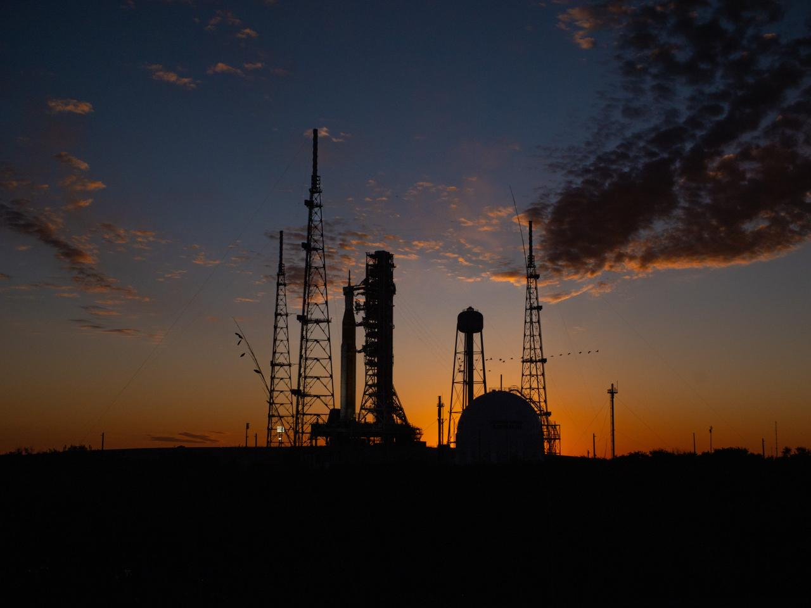

# 2026年中国商业航天进入"量产元年"，全年发射有望破百次

**摘要：** 2026年，中国航天全年发射次数预计突破100次，其中商业发射超60次、民营火箭承担超30次，商业航天正式进入"量产元年"。截至4月中旬，全国年内已完成商业发射16次，入轨商业卫星超130颗，占同期入轨卫星总量的90%。蓝箭航天、中科宇航两家头部企业已先后冲刺科创板，"商业航天第一股"争夺战进入白热化阶段。

*图片来源：NASA（公共领域图片，用于说明全球商业航天发展态势）*

## 数据：商业航天"量产元年"已至

据国家航天局和中科宇航的公开数据，2024年至2026年中国航天发射次数呈三级跳态势：

| 年份 | 总发射次数 | 备注 |
|------|-----------|------|
| 2024年 | 68次 | — |
| 2025年 | 92次 | 历史新高 |
| 2026年目标 | 约140次 | 同比增长约52% |

2026年，中国航天全年发射次数预计突破100次，其中**商业发射超60次**，占比超过60%；**民营商业火箭发射预计超30次**。截至4月中旬，全国年内已完成商业发射16次，入轨商业卫星超130颗，占同期入轨卫星总量的90%左右。

## 从"能上天"到"能落地"：商业航天驶入快车道

国家航天局日前在2026年"中国航天日"新闻发布会上明确，将商业航天纳入国家航天发展总体布局，推动行业从技术验证阶段全面转向工程化应用与产业化布局阶段。

多家研究机构指出，2026年将是中国商业航天元年，这已成为行业共识。商业航天正从技术验证阶段进入规模化工程阶段，可回收火箭技术进入密集验证期。

## 商业航天"第一股"争夺战白热化

在政策红利持续释放下，商业航天企业资本化进程全面提速。**蓝箭航天**、**中科宇航**两家头部企业已先后冲刺科创板，"商业航天第一股"争夺战进入白热化阶段。

力箭二号（遥一）于2026年3月30日在东风商业航天创新试验区成功首飞，是力箭系列运载火箭第12次发射，也是中科宇航大运力火箭的重要里程碑。力箭二号作为中国首款"通用助推器核心"（CBC）构型运载火箭，首飞即服务于国家重大战略和重大工程建设，标志着民营商业火箭从"试验品"向"实用型"加速转变。

## 中国商业航天"家底"

据中科宇航创始人兼董事长杨毅强介绍，中国商业航天发展现状：

- 具备总体设计能力的商业火箭企业约50家
- 积极推进研制的39家
- 已完成飞行试验技术验证的8家
- 正在开展首飞准备的11家

主要商业火箭型号包括：力箭二号（中科宇航）、朱雀三号（蓝箭航天，液氧甲烷可复用）、天龙三号（天兵科技）、谷神星一号（星河动力，海射型）等。

## 信息来源（原文）

- [可回收技术破局在即，供应链重构成商业航天降本关键](http://news.hexun.com/2026-04-24/224050788.html)（和讯网）
- [商业航天企业资本化进程提速，供应链重构成商业航天降本关键](https://finance.sina.com.cn/stock/t/2026-04-24/doc-inhvpusq4989327.shtml)（新浪财经）
- [力箭二号打响头炮，2026中国商业航天进入"密集发射期"](https://m.cls.cn/detail/2333058)（华尔街见闻）
- [中国2026年瞄准140次发射！商业航天狂飙突进](https://new.qq.com/rain/a/20260401A076KI00)（新京报）
