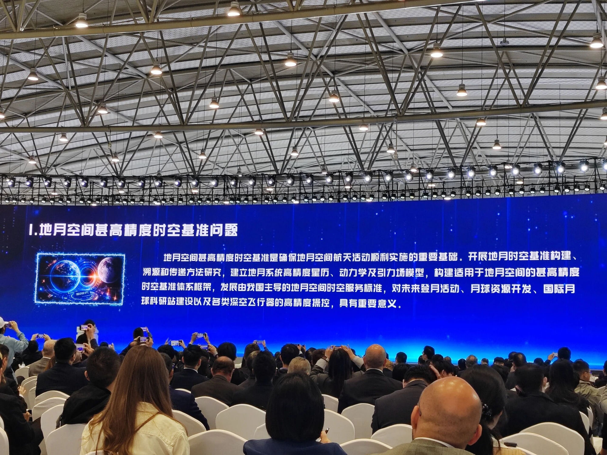
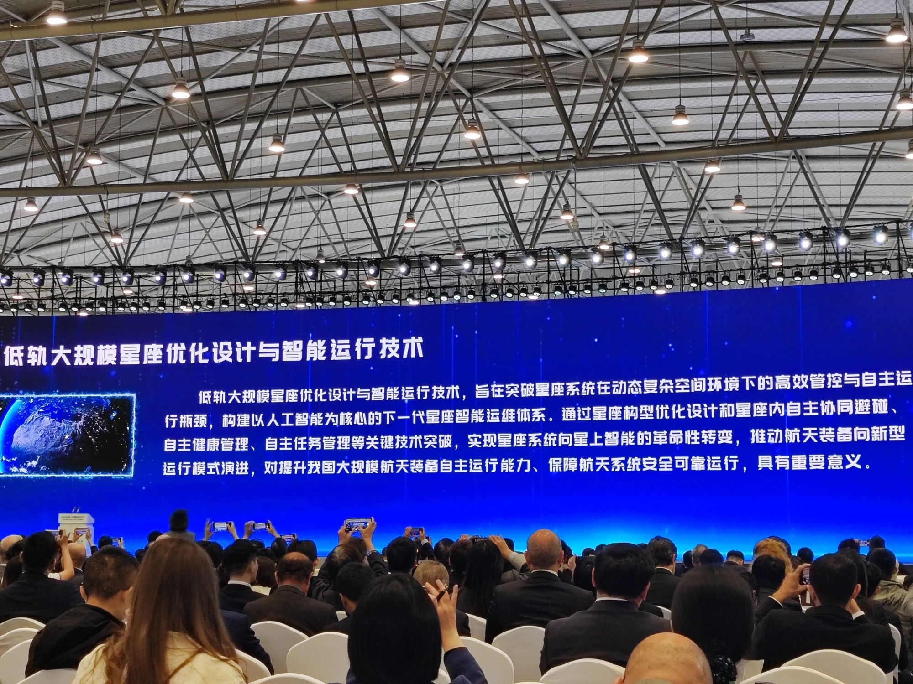
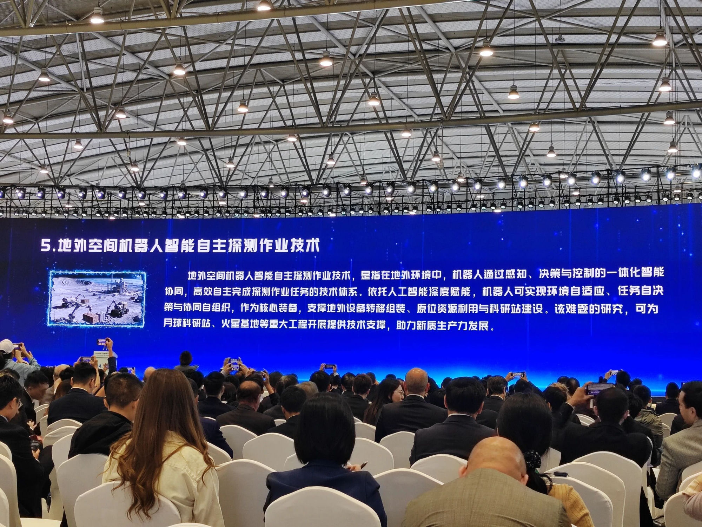
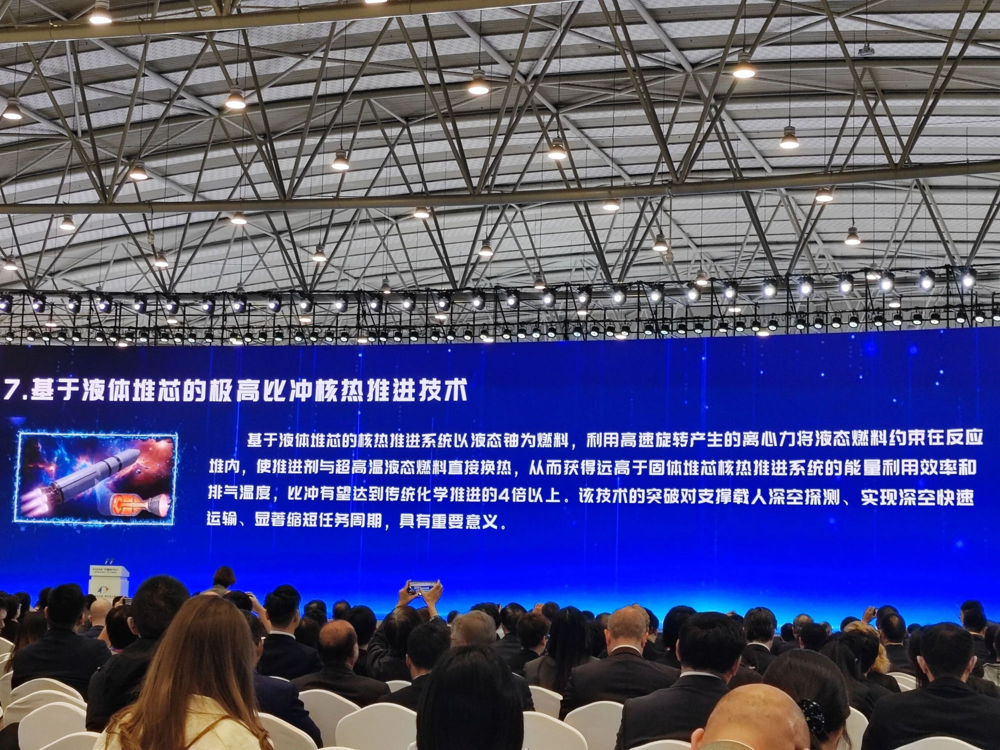
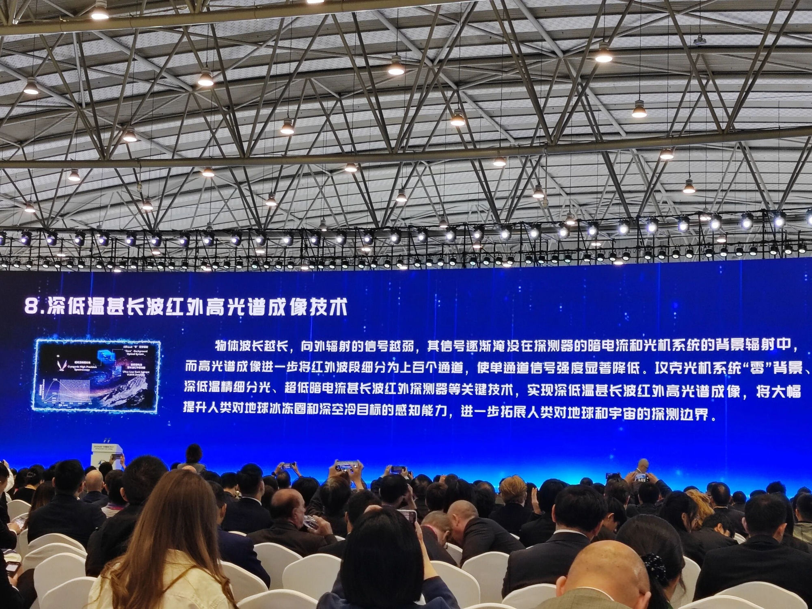
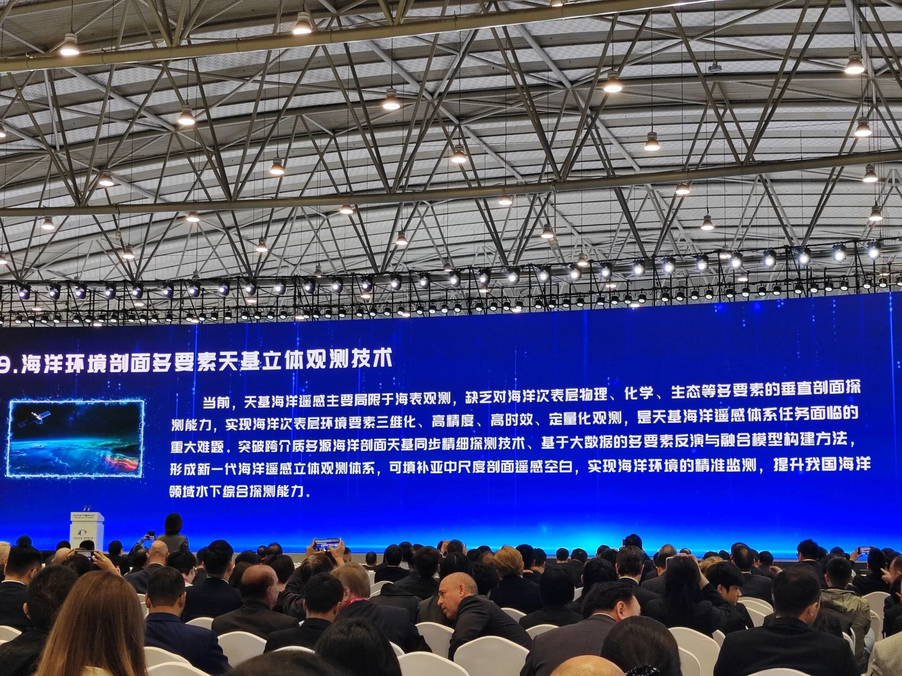

# 2026年宇航领域科学问题和技术难题发布

**摘要：** 2026年4月23日，2026年中国航天大会（CSC2026）在成都举行"2026年宇航领域科学问题和技术难题发布仪式"，正式发布年度十大科学问题和技术难题。本次发布的十大难题涵盖地月空间时空基准、月壤原位发电、太空交通管控、大规模星座、地外机器人、POGO抑制、核热推进、深低温红外高光谱、海洋剖面天基观测、卫星低成本制造等前沿方向，为航天领域科技创新提供方向指引。

*Credit: 中国宇航学会 / 2026年中国航天大会*

## 信息来源

- [2026年中国航天大会（CSC2026）官方议程 - 中国宇航学会](https://www.spaceflightfans.cn/news/2026_csc2026_agenda)

> 2026年4月23日，中国航天大会发布2026年宇航领域十大科学问题和技术难题。

## 发布背景

宇航领域科学问题和技术难题的征集与发布工作，始于2018年中国航天大会首届年会，每年面向航天领域学术界和产业界广泛征集，经多轮专家评审后正式发布。该工作旨在围绕航天强国建设目标，研判当前和未来一段时期内制约我国航天事业发展的关键科学与技术瓶颈，为航天领域基础研究和核心技术攻关提供方向指引。

2026年的十大难题于4月23日在CSC2026大会上正式发布，涵盖深空探测、空间基础设施、运载火箭、卫星应用等多个方向，呈现出**地月空间聚焦增强**、**人工智能深度融入**、**商业化规模化导向明显**三大特征。

---

## 一、地月空间甚高精度时空基准问题

*Credit: 中国宇航学会 / 2026年中国航天大会*

地月空间甚高精度时空基准是确保地月空间航天活动顺利实施的重要基础。开展地月时空基准构建、溯源和传递方法研究，建立地月系统高精度星历、动力学及引力场模型，构建适用于地月空间的甚高精度时空基准体系框架，发展由我国主导的地月空间时空服务标准，对未来登月活动、月球资源开发、国际月球科研站建设以及各类深空飞行器的高精度操控，具有重要意义。

**关键词：** 地月空间、时空基准、星历模型、引力场模型

## 二、月壤原位储热机制及发电方法

*Credit: 中国宇航学会 / 2026年中国航天大会*

月面长期全时段探测的能源供给，是未来月球探测任务的核心瓶颈之一，现有能源供给方式远不能满足任务需求。月壤作为月面广泛赋存的原位资源，成为能源供给变革的首选，如何构建"热能采集—存储—释放—发电"完整机制，是未来月壤原位发电亟待解决的重要科学问题。该问题的研究对月壤热物性分析、储热材料改性优化等技术发展，具有突破性意义。

**关键词：** 月壤、原位资源利用、储热、发电、能源供给

## 三、复杂环境下太空交通精准预测与智能管控技术

*Credit: 中国宇航学会 / 2026年中国航天大会*

复杂环境下太空交通精准预测与智能管控技术，旨在解决复杂、动态空间环境和太空物体的感知、认知和预测难题，构建自主智能高效的太空交通管控管理体系。亟待突破大气密度多星多源协同高精度探测、自主高精度大气模型构建、太空物体天基光学精准探测和定轨、复杂空间环境条件下动态天路生成等技术，实现对日益拥挤的太空物体的高精度轨道预报、碰撞风险评估与智能协同处置，确保太空交通安全和太空治理成效。

**关键词：** 太空交通管控、碰撞风险评估、天基光学探测、大气模型

## 四、低轨大规模星座优化设计与智能运行技术

*Credit: 中国宇航学会 / 2026年中国航天大会*

低轨大规模星座优化设计与智能运行技术，旨在突破星座系统在动态复杂空间环境下的高效管控与自主运行瓶颈，构建以人工智能为核心的下一代星座智能运维体系。通过星座构型优化设计和星座内自主协同避碰、自主健康管理、自主任务管理等关键技术突破，实现星座系统向星上智能的革命性转变，推动航天装备向新型运行模式演进，对提升我国大规模航天装备自主运行能力、保障航天系统安全可靠运行，具有重要意义。

**关键词：** 低轨星座、人工智能、自主避碰、健康管理、星座运维

## 五、地外空间机器人智能自主探测作业技术

*Credit: 中国宇航学会 / 2026年中国航天大会*

地外空间机器人智能自主探测作业技术，是指在地外环境中，机器人通过感知、决策与控制的一体化智能协同，高效自主完成探测作业任务的技术体系。依托人工智能深度赋能，机器人可实现环境自适应、任务自决策与协同自组织，作为核心装备，支撑地外设备转移组装、原位资源利用与科研站建设。该难题的研究，可为月球科研站、火星基地等重大工程开展提供技术支撑，助力新质生产力发展。

**关键词：** 地外机器人、人工智能、自主探测、原位资源利用

## 六、多机并联可重复使用液体火箭纵向耦合振动（POGO）的有效抑制技术

*Credit: 中国宇航学会 / 2026年中国航天大会*

重复使用火箭采用深度可调、多机并联的动力系统方案，各级上升段和返回减速段采用不同的输送系统模式和推力工况。针对重复使用火箭全剖面飞行过程的纵向耦合振动（POGO）抑制难题，研究不同的发动机循环方式和推力工况、输送系统工作模式对POGO振动的作用机理和影响规律，掌握全剖面的POGO抑制技术，从而为可重复使用火箭的POGO稳定性控制和响应抑制，提供有效技术支撑。

**关键词：** POGO振动、纵向耦合振动、可重复使用火箭、多机并联

## 七、基于液体堆芯的极高比冲核热推进技术

*Credit: 中国宇航学会 / 2026年中国航天大会*

基于液体堆芯的核热推进系统以液态铀为燃料，利用高速旋转产生的离心力将液态燃料约束在反应堆内，使推进剂与超高温液态燃料直接换热，从而获得远高于固体堆芯核热推进系统的能量利用效率和排气温度，比冲有望达到传统化学推进的4倍以上。该技术的突破对支撑载人深空探测、实现深空快速运输、显著缩短任务周期，具有重要意义。

**关键词：** 核热推进、液体堆芯、高比冲、深空探测

## 八、深低温甚长波红外高光谱成像技术

*Credit: 中国宇航学会 / 2026年中国航天大会*

物体波长越长，向外辐射的信号越弱，其信号逐渐淹没在探测器的暗电流和光机系统的背景辐射中，而高光谱成像进一步将红外波段细分为上百个通道，使单通道信号强度显著降低。攻克光机系统"零"背景、深低温精细分光、超低暗电流甚长波红外探测器等关键技术，实现深低温甚长波红外高光谱成像，将大幅提升人类对地球冰冻圈和深空冷目标的感知能力，进一步拓展人类对地球和宇宙的探测边界。

**关键词：** 甚长波红外、高光谱成像、深低温、探测器暗电流

## 九、海洋环境剖面多要素天基立体观测技术

*Credit: 中国宇航学会 / 2026年中国航天大会*

当前，天基海洋遥感主要局限于海表观测，缺乏对海洋次表层物理、化学、生态等多要素的垂直剖面探测能力，实现海洋次表层环境要素三维化、高精度、高时效、定量化观测，是天基海洋遥感体系任务面临的重大难题。突破跨介质多源海洋剖面天基同步精细探测技术、基于大数据的多要素反演与融合模型构建方法，形成新一代海洋遥感立体观测体系，可填补亚中尺度剖面遥感空白，实现海洋环境的精准监测，提升我国海洋领域水下综合探测能力。

**关键词：** 海洋遥感、次表层探测、天基观测、交叉介质

## 十、面向巨型星座的商业卫星低成本智能制造技术

*Credit: 中国宇航学会 / 2026年中国航天大会*

面向巨型星座的商业卫星低成本智能制造技术，以柔性智能化生产线、模块化架构、工业级供应链协同和运行可靠性设计为核心，是一套适应工业化大规模生产的智能制造方案。为支撑由数万颗卫星组成的星座建设，需突破传统定制化卫星生产效率低、成本高的瓶颈，实现批量化制造成本数量级的下降。该技术不仅是构建第六代移动通信（6G）空天地一体化网络的重要基础，也将带动高端制造产业链升级，推动航天产业从小量专门定制向批量智能制造模式的转型。

**关键词：** 巨型星座、智能制造、商业卫星、模块化架构

---

## 综述

本次发布的十大难题从三个维度系统勾勒了未来航天科技攻关的方向：

**地月空间与深空探测方面**（难题一、二、五、七），聚焦地月空间时空基准构建、月面原位能源获取、地外自主机器人、核热推进等基础性和前沿性课题，为月球科研站、载人深空探测等重大工程提供技术储备。

**空间基础设施与运行管理方面**（难题三、四、十），关注太空交通治理、星座智能化运维、卫星批量制造等系统性问题，回应了低轨空间日益拥挤、星座规模化部署的现实挑战。

**载荷与感知技术方面**（难题六、八、九），从火箭动力系统的 POGO 振动抑制到甚长波红外高光谱成像和海洋次表层立体观测，着眼于提升装备可靠性和环境感知的深度与广度。

> 来源：2026年中国航天大会（CSC2026）现场发布，2026年4月23日，成都。
