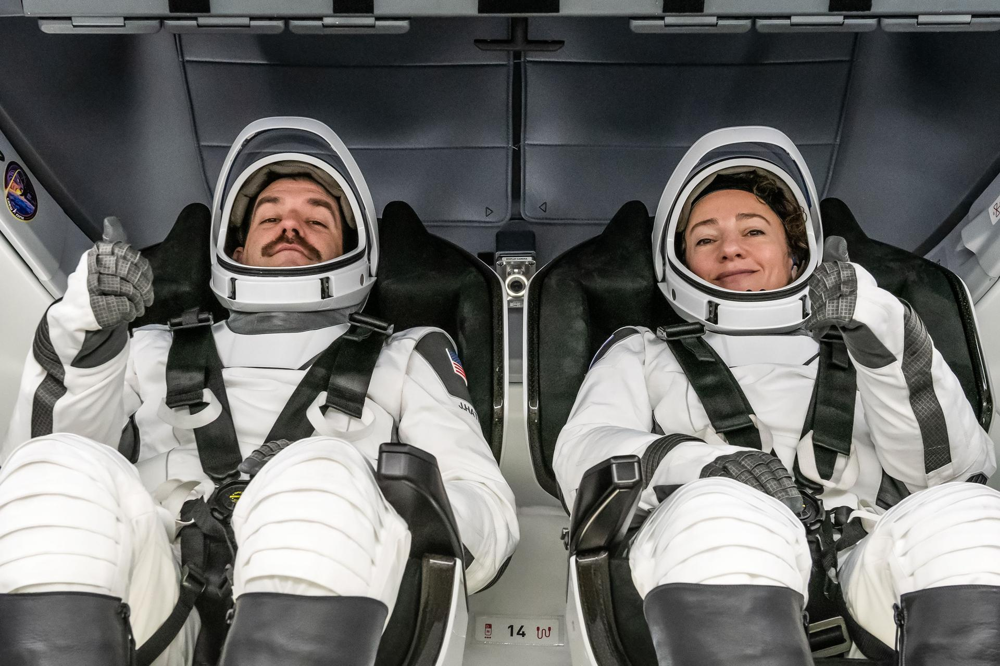

# NASA 航天员将在国际空间站回答密苏里州学生提问

**摘要：** 2026年4月24日，NASA 宣布，航天员 Jessica Meir 和 Jack Hathaway 将在国际空间站任务期间，回答来自密苏里州学生的预先录制科学、技术、工程与数学（STEM）问题。此次活动旨在激励学生参与 STEM 领域学习，感受太空探索的魅力。

*Credit: NASA*

密苏里州的学生们将有机会通过此次活动，了解航天员在轨工作与生活的真实状态。Jessica Meir 曾于 2019 年执行远征 59/60 任务，完成了人类历史上首次全女性太空行走；Jack Hathaway 作为 NASA 商业载人计划培养的航天员，此次将是他首次进入太空。

此次天地对话活动是 NASA 推动 STEM 教育的重要组成部分，通过连接太空与课堂，激发学生对科学探索的兴趣。

## 信息来源（原文）

- [NASA Astronauts to Answer Questions from Missouri Students](https://www.nasa.gov/news-release/nasa-astronauts-to-answer-questions-from-missouri-students/)
