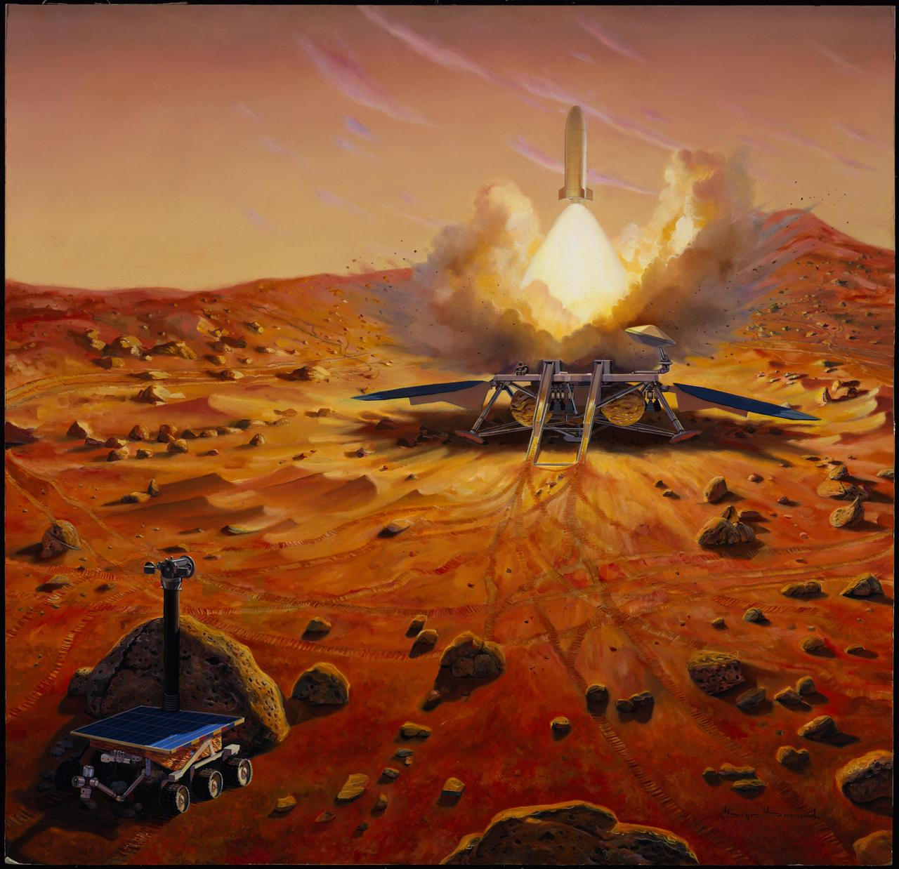

# 天问三号计划2028年前后发射，2031年携火星样品返回地球

**摘要：** 2026年4月24日，国家航天局在第十一个中国航天日主场活动启动仪式上正式发布天问三号任务计划：计划于2028年前后实施发射，2031年前后携带火星样品返回地球。同日，国家航天局面向国际社会发布《天问三号火星取样返回任务国际合作机遇公告》，开放天问三号探测器20千克质量资源，与国际同行共同开展火星探测与研究。

*Credit: NASA / JPL-Caltech（示意图，仅用于说明天问三号任务类型）*

## 天问三号任务概况

天问三号是中国行星探测工程的重要组成部分，计划实现人类首次火星取样返回。探测器由着陆器、上升器、服务器组合体和轨道器、返回器组合体组成，共配置6台科学载荷：

- **轨道器**：环火轨道约350公里，对日定向，设计寿命不少于5年，配置中红外超精细成像光谱仪和火星全球多色相机
- **服务器**：环火大椭圆轨道（近火点约400公里），留轨探测约2个火星年，设计寿命不少于5年，配置沉降ENA极光探测仪和高精度矢量磁强计
- **着陆器**：配置超宽带探测雷达和拉曼-荧光光谱仪

## 国际合作载荷遴选结果

自2025年4月国家航天局发布合作机遇公告后，共收到28份合作意向，最终遴选出5个合作项目：

**轨道器合作载荷（3台）：**
- 国际空间研究委员会探索工作组牵头研制的**火星PEX光谱仪**，用于开展火星生命痕迹探寻及表面矿物成分探测
- 澳门科技大学牵头研制的**火星分子离子成分分析仪**，用于开展火星大气逃逸过程探测
- 香港中文大学牵头研制的**激光外差光谱仪**，用于开展火星大气水同位素廓线分布及火星风场探测

**服务器合作载荷（1台）：**
- 香港大学牵头研制的**火星地物高光谱成像仪**，用于开展生命痕迹、含水矿物及资源普查等探测

**着陆器合作载荷（1台）：**
- 意大利国家核物理研究院-弗拉斯卡蒂国家实验室牵头研制的**激光角反射器阵列**，用于在火星表面布设精确基准点

## 开放国际合作资源

国家航天局此次共开放天问三号探测器20千克质量资源，其中轨道器资源不超过15千克、服务器资源不超过5千克，欢迎国际伙伴参与天问三号任务合作。

## 信息来源（原文）

- [天问三号任务计划于2031年前后携带火星样品返回地球](https://www.yangtse.com/news/kj/202604/t20260424_345485.html)（新华社）
- [天问三号任务计划于2031年前后携带火星样品返回地球](https://new.qq.com/rain/a/20260424A02ZS100)（钛媒体）
- [天问三号任务计划于2031年前后携带火星样品返回地球](https://new.qq.com/rain/a/20260424A02X9B00)（人民日报客户端）

> 国家航天局探月与航天工程中心主任关锋表示，天问三号主要是火星取样、返回，按计划将于2028年前后发射实施。
