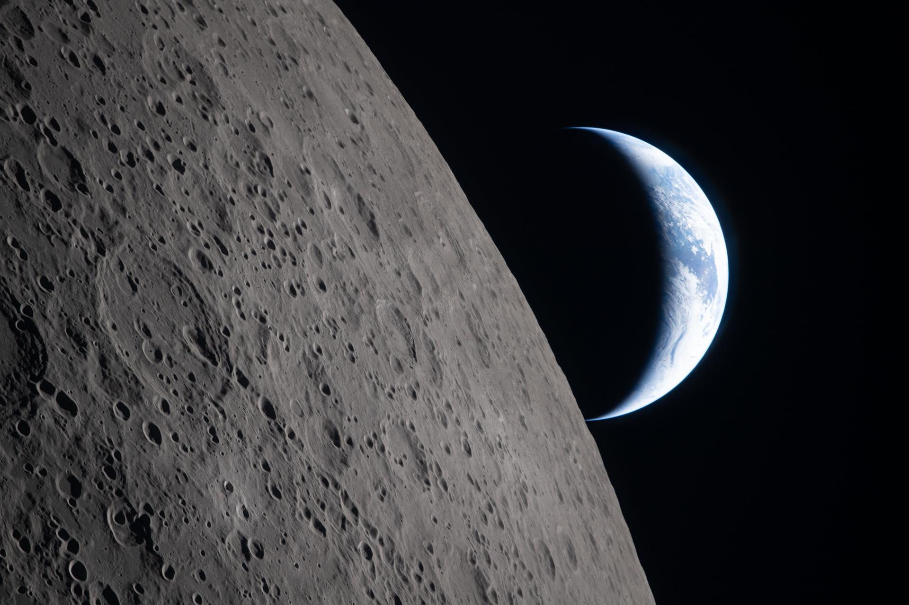

# Artemis II宇航员在奔月途中拍摄地球「下落」奇观

**摘要：** 2026年4月6日，NASA Artemis II任务的四名宇航员在前往月球途中，从猎户座飞船拍摄了地球在月球背影下缓缓下落的壮观景象。这张编号为 art002e015231 的照片捕捉到了地球被月球阴影遮挡、即将「消失」于月平线之下的瞬间，被NASA Science形容为「史上最壮观的地月合影之一」。

*图片来源：NASA（公共领域）*

2026年4月6日，NASA Artemis II任务的宇航员们在奔月途中拍摄了一系列历史性的影像。其中最令人震撼的一张照片捕捉到了地球在月球阴影中缓缓下落的壮观景象——在月球引力的背景下，地球缓缓坠入月平线之下，仿佛一场宇宙级的「日落」。

## 历史性时刻

Artemis II于2026年4月1日从肯尼迪航天中心发射升空，执行人类50多年来首次载人绕月飞行任务。在任务第六天（4月6日），当猎户座飞船穿越月球背面时，飞船与地面控制中心失去了约40分钟的通信联系——这是因为月球本身阻挡了信号传输。就在这短暂的「失联」期间，宇航员们拍摄了这张令人叹为观止的照片。

*图片来源：NASA（公共领域）*

照片中可以看到地球在月球表面上方缓缓下降，月球粗糙的地表和环形山清晰可见。这与1969年阿波罗宇航员拍摄的著名「地出」（Earthrise）照片形成了鲜明对比——如果说「地出」是地球从月平线上升起，那么这张照片则捕捉到了地球下落的「镜像」瞬间。

## Artemis II任务概况

Artemis II是NASA Artemis计划的首次载人飞行任务，四名宇航员为：

- **指令长里德·怀斯曼（Reid Wiseman）**
- **飞行员维克托·格洛弗（Victor Glover）**
- **任务专家克里斯蒂娜·科赫（Christina Koch）**
- **任务专家杰里米·汉森（Jeremy Hansen，加拿大航天局）**

任务于4月1日发射，4月2日完成地月转移注入（TLI）点火，进入绕月自由返回轨道。宇航员们在10天的任务中创造了多项历史纪录，包括人类有史以来到达的最远距离。

*图片来源：NASA（公共领域）*

## 任务圆满成功

Artemis II任务于4月10日圆满结束，猎户座飞船在加利福尼亚州圣迭戈附近太平洋海域溅落。四名宇航员安全返回地球，整个任务持续约10天，traveled farther from Earth than any humans in more than 50 years。

NASA Science在庆祝地球日（4月22日）之际发布了这一系列照片，称这些影像「极其壮观，具有划时代意义」。

## 信息来源（原文）

- [NASA: Welcome Home – Artemis II crew returned to Earth](https://www.nasa.gov/)
- [NASA Science: Earth Day 2026](https://science.nasa.gov/)
- [NASA Image and Video Library: art002e015231](https://images.nasa.gov/)
