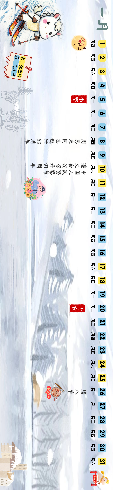

# 银河航天八年追「星」路：从零起步到商业航天第一家独角兽

**摘要：** 2026年4月24日14时35分，我国在西昌卫星发射中心使用长征二号丁运载火箭，以一箭四星方式成功将卫星互联网技术试验卫星送入预定轨道。其中一颗卫星由银河航天（北京）科技集团股份有限公司承担研制，将在轨开展手机宽带直连卫星、天地网络融合等技术试验验证。同日，银河航天迎来成立八周年——八年间，这家商业航天民营企业从零起步，累计发射自研卫星40余颗，建成我国首个低轨宽带通信试验星座「小蜘蛛网」，成为国内商业航天领域第一家独角兽公司。

*图片来源：银河航天（已获授权转载）*

2026年4月24日14时35分，西昌卫星发射中心，长征二号丁运载火箭点火起飞，以一箭四星的方式成功将卫星互联网技术试验卫星送入预定轨道。本次发射是长征二号丁运载火箭的第104次飞行，也是长征系列运载火箭的第639次发射。

执行本次任务的长征二号丁运载火箭由中国航天科技集团有限公司八院抓总研制，是一型常温两级液体运载火箭，具备适应不同轨道要求的单星及多星发射能力，太阳同步圆轨道运力为1.3吨（轨道高度700公里）。

## 银河航天八年：从「小蜘蛛网」到行业独角兽

就在同一天，银河航天迎来了公司成立八周年的重要里程碑。2018年4月正式投入运营以来，银河航天始终专注于卫星互联网技术研发与星座建设，已发展成为国内商业航天领域的标杆企业。

**八年成就一览：**

- **卫星数量：** 累计发射自研卫星40余颗，总重量超过20吨
- **在轨星座：** 建成我国首个低轨宽带通信试验星座「小蜘蛛网」，由8颗卫星组成，可实现连续30分钟宽带通信，已完成国内首次多星连续通信测试
- **研发能力：** 已实现国内首个Ka频段8波束相控阵天线在轨；星载相控阵产品累计交付超300副、在轨超200副；Q/V天线年产能达300副，在轨超100副，在商业航天领域处于领先地位
- **行业地位：** 成为国内商业航天领域第一家独角兽公司

## 手机直连：对标「星链」的技术实力

本次发射的卫星互联网技术试验卫星搭载了银河航天自主研制的多项核心技术产品，研发团队针对卫星设计和测试等进行了多项优化，有效提高了生产及发射部署效率。

据银河航天首席技术官朱正贤介绍，在手机直连方面，公司已构建起对标SpaceX「星链」的手机直连技术水平，累计发射多颗具备手机直连功能的技术试验星，具备了自研芯片化基带处理组件的能力，技术实力国际领先。

## 卫星批量生产能力：年产百颗中型卫星

银河航天位于南通的卫星智慧工厂，目前已构建起100至2000公斤级卫星的完整制造链条，年产中型卫星能力稳定在100至150颗，卫星研制周期较传统模式缩短了80%。

在舱板装配环节，团队研发出机器人柔顺力控装配系统，结合自动柔顺对接算法，将舱板装配效率提升了80%以上。搭载六维力传感器的机械臂展开卫星舱板时，精度较人工操作提升了一个量级。

## 信息来源（原文）

- [新华社：我国成功发射卫星互联网技术试验卫星](https://new.qq.com/rain/a/20260424A06NAQ00)
- [封面新闻：我国成功发射卫星互联网技术试验卫星 助力太空新基建](https://so.html5.qq.com/page/real/search_news?docid=70000021_79569eb564b72252)
- [经济观察报：银河航天八年追「星」路](https://www.toutiao.com/article/7632887430575620654/)
- [证券之星：银河航天八年追「星」路](https://finance.stockstar.com/IG2026042600005138.shtml)
