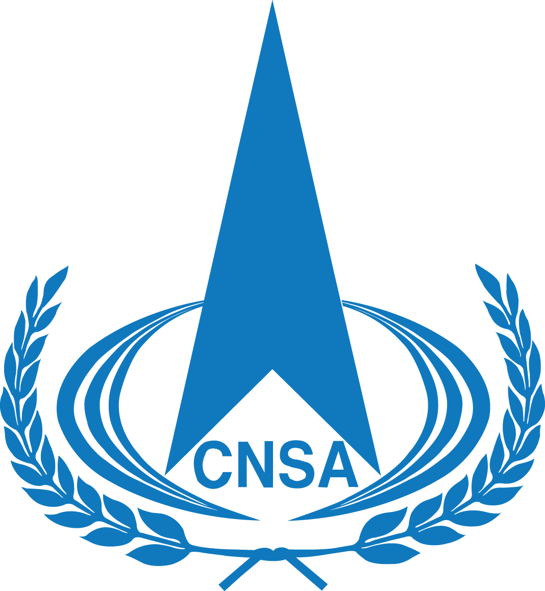

# 中国航天公益形象大使进校园活动走进四川大学

**摘要：** 4月24日，由国家航天局新闻宣传中心、四川大学联合主办的「中国航天公益形象大使」进校园公益科普活动在四川大学江安校区水上报告厅顺利举行。北斗副总设计师谢军、中科院院士张兵、神舟十七号航天员江新林等嘉宾与400余名师生面对面，讲述中国航天故事，激励青年学子投身航天事业。

*Credit: 国家航天局*

活动由学生工作部部长熊伟主持。国家航天局新闻宣传中心副主任李阳在致辞中表示，中国航天七十年来取得的辉煌成就点燃了每一位中国人心中的光荣与梦想，一代代航天人的光辉事迹是激励青年学子奋发向上的榜样，此次活动旨在普及航天知识、弘扬航天精神、传播航天文化，希望广大青年学子心怀星辰大海、勇闯科技前沿，以青春之力续写奋斗华章。

在专题报告环节，北斗重大专项工程副总设计师谢军以「自主创新，铸就国之重器」为题，全面回顾了北斗系统自主创新之路，生动诠释了新时代北斗精神。中国科学院院士张兵从遥感科学与技术前沿视角，深度解析了航天科技赋能国计民生的创新实践。神舟十七号航天员江新林深情讲述了历经层层选拔与严苛训练，最终成为航天员并奔赴星海、圆梦太空的成长经历与拼搏故事。

互动交流环节，学生们踊跃参与，围绕北斗自主研发、遥感前沿技术、航天员飞天经历与青年成长路径等话题向嘉宾请教，现场交流气氛热烈。

> 此次活动为师生们带来了一场精彩纷呈的科普盛宴与催人奋进的思政大课，让青年学生近距离接触航天前沿知识、感悟航天精神伟力，进一步坚定了练就过硬本领、投身强国伟业的理想信念。

## 信息来源（原文）

- [「中国航天公益形象大使」进校园 公益科普活动四川大学专场顺利举办](https://www.cnsa.gov.cn/n6758823/n6758838/c10744498/content.html)
