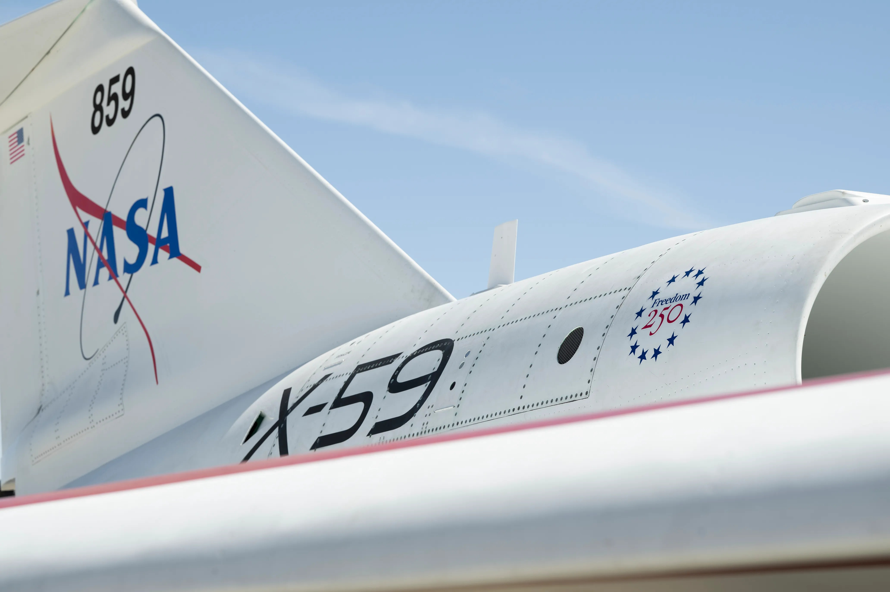

# NASA X-59 静音超音速验证机获得「自由250」纪念涂装，庆祝美国独立250周年

**摘要：** 2026年4月27日，NASA 宣布其 X-59 静音超音速验证机获得专属的「Freedom 250」纪念涂装，以庆祝美国2026年独立250周年（1776→2026）。新涂装绘于 X-59 的尾翼和发动机舱，展示了美国国旗元素与纪念标识。该机是 NASA 静音超音速飞行（QSST）项目的核心，目标是将商业超音速飞行的音爆噪音降低至公众可接受的水平。

*图片来源：NASA / Carla Thomas*

## X-59：改变超音速飞行未来的验证机

X-59 是 NASA 静音超音速技术验证机（Quiet SuperSonic Technology aircraft），由洛克希德·马丁臭鼬工厂研制。该机型的核心目标是解决自协和式飞机以来困扰商业超音速客机的「音爆」问题——协和式飞机因在陆地上空超音速飞行产生巨大音爆，被多个国家禁止在陆地上空进行超音速飞行，最终导致其于2003年退役。

X-59 通过独特的外形设计（包括修长的尖锥机头和特殊截面机身），将超音速飞行时产生的冲击波分散为更柔和的「音爆」，地面上人们听到的声音将类似于「砰」的一声，而非传统超音速飞行震耳欲聋的音爆。NASA 计划利用 X-59 在美国多个城市上空进行超音速飞行测试，收集公众对这种「安静」超音速飞行的反应数据。

## Freedom 250 纪念涂装

「Freedom 250」（自由250）是美国为庆祝2026年独立250周年而设立的特殊纪念标识。NASA 选择为 X-59 喷涂这一纪念涂装，象征美国在航空领域持续引领创新的精神。新涂装包含星条旗元素和「Freedom 250」字样，于2026年4月公开展示。

X-59 项目的负责人表示：「我们很高兴通过这种方式庆祝美国独立250周年。X-59 代表了美国在航空前沿的探索精神——就像250年前的先驱者们为自由而战一样，我们也在为更安静的航空未来而创新。」

## 项目进展与后续测试计划

X-59 已完成多项地面测试和滑行测试，计划于2026年内进行首飞。首飞成功后，NASA 将开展一系列超音速飞行测试，飞行速度约为 Ma 1.4（1.4倍音速），飞行高度约16000米。测试期间，NASA 将在飞行路线下方布置多个噪音监测点，收集地面音爆数据。

根据 NASA 的规划，X-59 的飞行测试数据将提交给美国联邦航空管理局（FAA）和国际民航组织（ICAO），推动修订关于超音速飞机在陆地上空飞行的法规。如果一切顺利，未来的「静音超音速」客机有望在2030年代投入商业运营。

## 信息来源（原文）

- [NASA's X-59 Gets Freedom 250 Logo - NASA](https://www.nasa.gov/image-article/nasas-x-59-gets-freedom-250-logo/)
