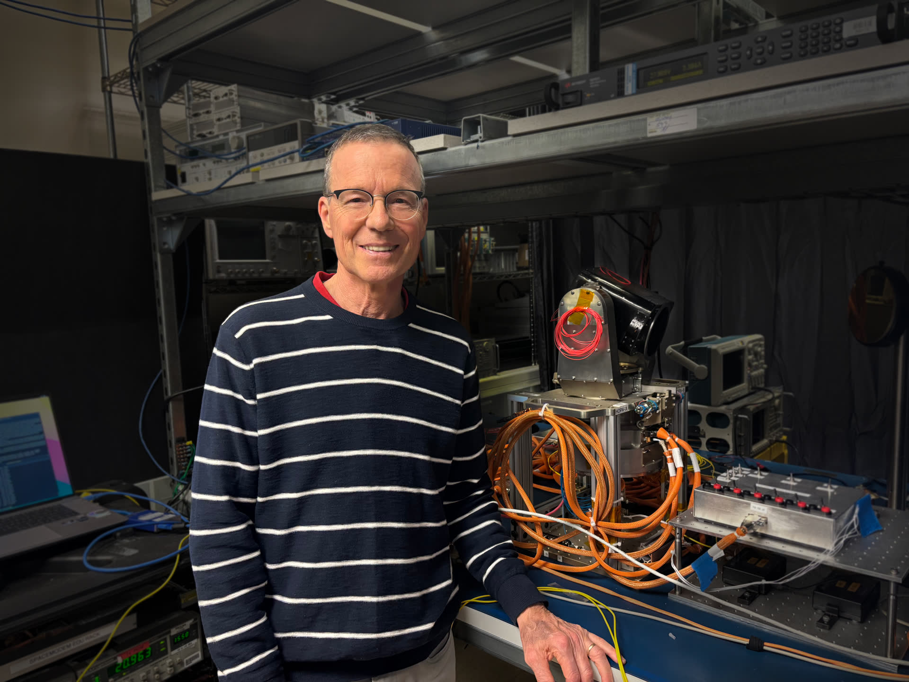

# 「我是阿尔忒弥斯」：Peter Rossoni 与猎户座激光通信系统

**摘要：** Peter Rossoni 从小随家人观看阿波罗任务发射。2026年4月，他成为 NASA 阿尔忒弥斯二号任务的一员，担任猎户座光学通信系统飞行经理（Orion Artemis II Optical Communications System Flight Manager），在人类重返月球的历史性任务中发挥关键作用。

*Credit: MIT-LL / Kendall Murphy*

## 从阿波罗到阿尔忒弥斯

Peter Rossoni 的航天之路始于童年时期与家人一同观看阿波罗任务的发射。这段早期经历激发了他对航天的热爱，并最终引导他进入 NASA 参与阿尔忒弥斯计划。

Rossoni 的父母均从事科学工作，他从小就打下了扎实的科学基础。这段背景最终引领他进入激光通信领域，并成为 NASA 阿尔忒弥斯二号测试飞行中猎户座光学通信系统的飞行经理。

## 光学通信系统飞行经理

作为猎户座阿尔忒弥斯二号光学通信系统的飞行经理，Rossoni 负责确保宇航员在前往月球途中与地面团队之间的通信畅通无阻。激光通信技术相比传统射频通信具有更高的数据传输速率，是未来深空通信的重要发展方向。

在2026年4月的阿尔忒弥斯二号任务中，Rossoni 与其团队确保了从火箭发射到宇航员完成绕月飞行的整个过程中，通信系统始终保持最佳状态。

## 任务背景

阿尔忒弥斯二号是人类时隔50多年首次进行的载人绕月飞行任务。在这次任务中，每一套系统都依赖可靠的信息传输，而通信系统是宇航员与地面控制中心保持联系的生命线。

Rossoni 表示：「能够参与人类重返月球的任务，是一种巨大的荣耀和责任。每一次数据传输都关系到任务的成败和我们宇航员的安全。」

## 信息来源（原文）

- [I Am Artemis: Peter Rossoni - NASA](https://www.nasa.gov/missions/artemis/i-am-artemis/i-am-artemis-peter-rossoni/)
