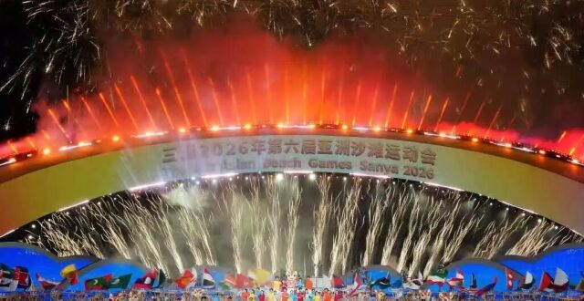

# 长征二号F火箭应急发射团队荣获「中国青年五四奖章集体」

**摘要：** 2026年4月27日，2026年度中国青年五四奖章暨新时代青年先锋奖评选结果正式揭晓。中国航天科技集团所属火箭院中国载人航天工程长征二号F运载火箭应急发射任务攻关团队荣获「中国青年五四奖章集体」。这支50多人的团队长期承担长征二号F载人运载火箭研制任务，是我国唯一具备载人火箭全流程生产能力的专业队伍，连续多年高质量完成神舟系列飞船配套火箭研制工作，产品交付成功率始终保持100%。

*图片来源：腾讯新闻（已获授权转载）*

## 团队概况

中国载人航天工程长征二号F运载火箭应急发射任务攻关团队是一支年轻的科研劲旅，35周岁以下青年人数占比61%，其中青年人占了多半，朝气蓬勃。这支50多人的团队长期承担长征二号F载人运载火箭的研制任务，是我国唯一具备载人火箭全流程生产能力的专业队伍。

长征二号F运载火箭被誉为「神箭」，是目前我国唯一一型载人运载火箭，从火箭研制到发射准备，团队全程掌控每一个技术细节，确保航天员乘组「不带隐患上天、不带问题上天」。

## 荣誉与成就

近年来，团队先后荣获全国杰出青年文明号、全国青年安全生产示范岗等荣誉，涌现出11名技术能手、9名青年骨干，获国家专利3项、国家标准1项，更新专业领域总装技术标准40余项。

2025年11月25日，团队成功执行了我国首次载人航天应急发射任务——神舟二十二号飞船应急发射。在原定飞船返回任务因空间微小碎片撞击风险推迟的情况下，团队临危受命，在短短16天内完成全部总装测试工作并成功发射，实现了速度与质量的双重保障，充分展示了团队应对紧急任务的卓越能力。

## 应急发射与神舟二十二号

2025年11月25日12时11分，搭载神舟二十二号飞船的长征二号F遥二十二运载火箭在酒泉卫星发射中心点火发射，约10分钟后，飞船与火箭成功分离并进入预定轨道，发射任务取得圆满成功。这是中国载人航天工程第一次应急发射任务，也是长征二号F火箭团队在关键时刻展现出的过硬本领。

团队还承担神舟二十一号、神舟二十二号等历次载人发射任务的配套火箭研制工作，产品交付成功率始终保持100%，为我国载人航天工程的顺利进行提供了坚实保障。

## 信息来源（原文）

- [腾讯新闻：长二F火箭应急发射团队荣获「中国青年五四奖章集体」](https://new.qq.com/rain/a/20260428A01QNR00)
- [新华网：2026年度中国青年五四奖章暨新时代青年先锋奖评选结果揭晓](http://www.news.cn/government/20260427/6f15eac9a02847f582479e3f0022fa6c/c.html)
- [腾讯新闻：北京多名个人和集体获授2026年度中国青年五四奖章](https://new.qq.com/rain/a/20260427A07KK400)
